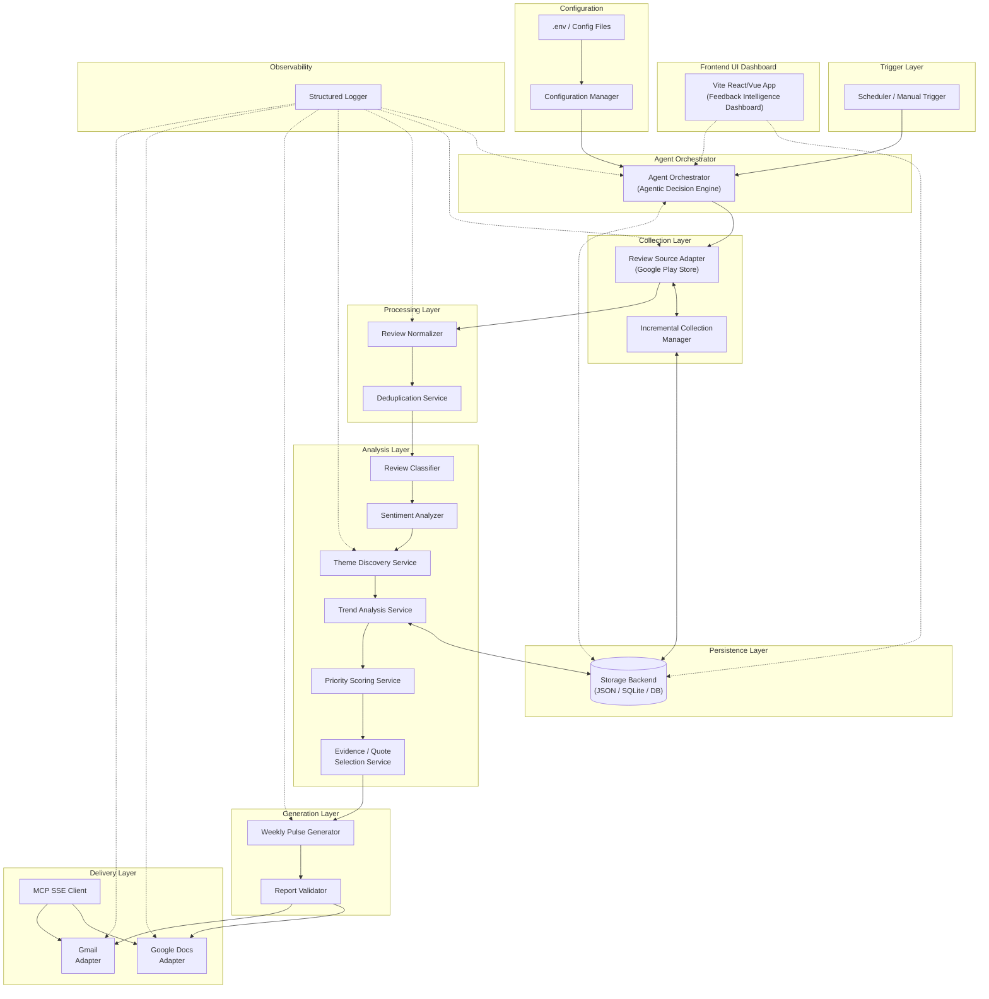
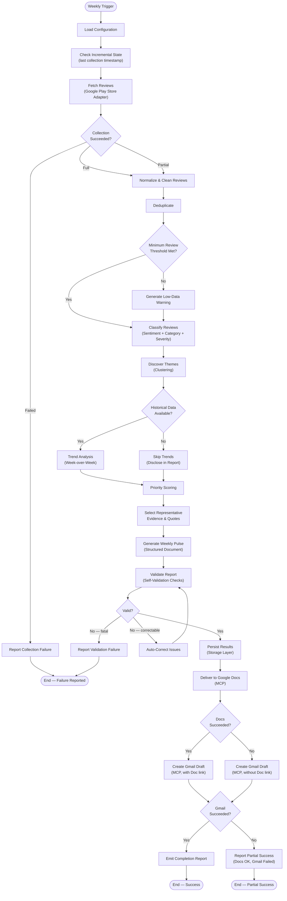
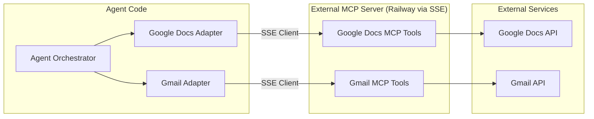
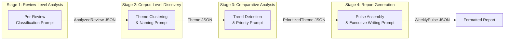
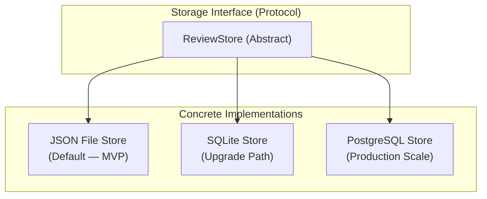
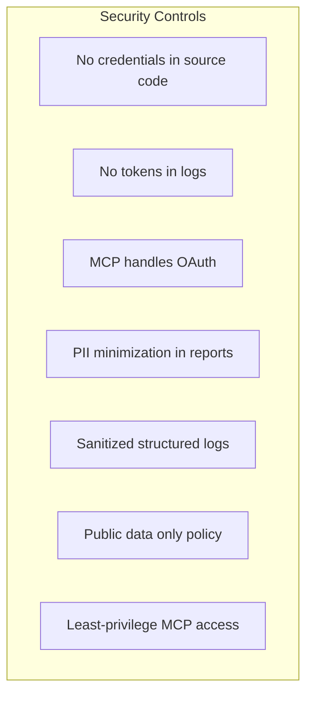
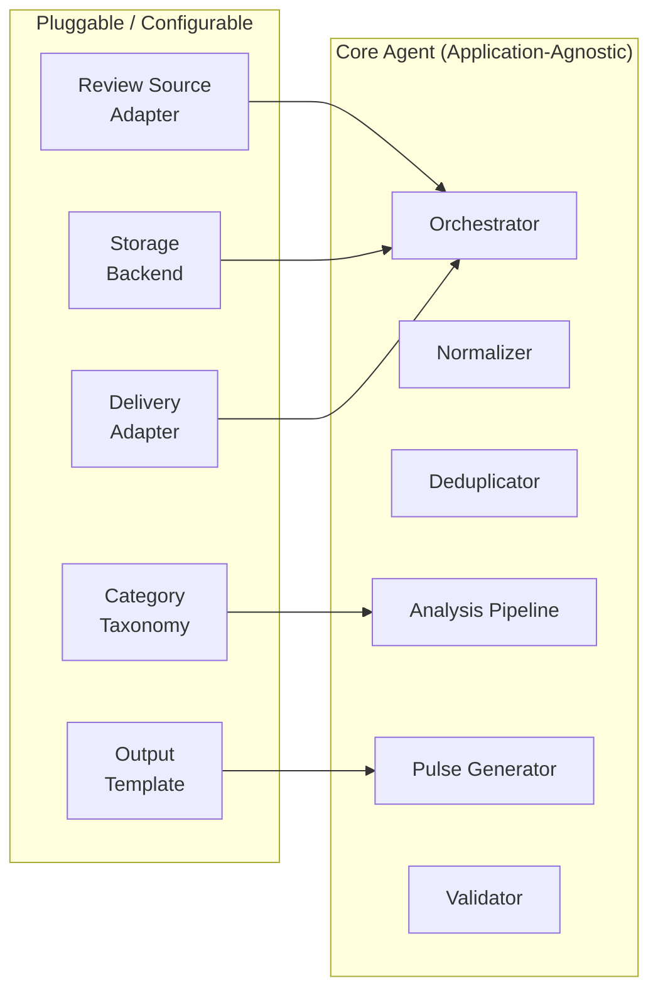
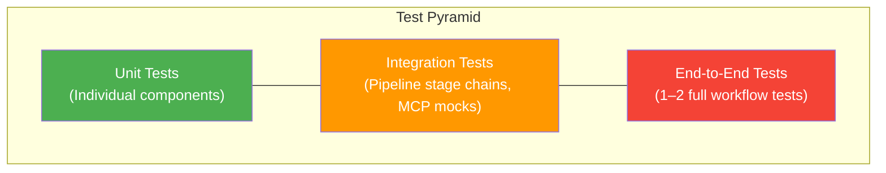

# Architecture: Groww Weekly User Feedback Intelligence AI Agent

**Version:** 1.0  
**Derived from:** [problemStatement.md](file:///d:/GenAI/Practice/Pranju/GROW_review_analysis_agent/docs/problemStatement.md)  
**Last updated:** 2026-09-05

---

## Table of Contents

1. [System Overview](#1-system-overview)
2. [Architecture Principles](#2-architecture-principles)
3. [High-Level Architecture Diagram](#3-high-level-architecture-diagram)
4. [Component Architecture](#4-component-architecture)
5. [Data Models & Schemas](#5-data-models--schemas)
6. [Data Flow & Pipeline Design](#6-data-flow--pipeline-design)
7. [MCP Integration Layer](#7-mcp-integration-layer)
8. [AI / LLM Pipeline Design](#8-ai--llm-pipeline-design)
9. [Storage Architecture](#9-storage-architecture)
10. [Configuration Architecture](#10-configuration-architecture)
11. [Security & Privacy Architecture](#11-security--privacy-architecture)
12. [Observability & Logging](#12-observability--logging)
13. [Error Handling & Resilience](#13-error-handling--resilience)
14. [Extensibility & Plugin Architecture](#14-extensibility--plugin-architecture)
15. [Scheduling & Execution Model](#15-scheduling--execution-model)
16. [Project Structure](#16-project-structure)
17. [Testing Strategy](#17-testing-strategy)
18. [Deployment Considerations](#18-deployment-considerations)

---

## 1. System Overview

The Groww Weekly User Feedback Intelligence Agent is an autonomous AI-powered system that:

1. **Collects** public Google Play Store reviews for the Groww mobile app.
2. **Cleans, normalizes, and deduplicates** the raw review data.
3. **Analyzes** each review for sentiment, classification, themes, and priority.
4. **Discovers** recurring and emerging themes across the review corpus.
5. **Compares** current-period findings against historical data for trend detection.
6. **Generates** a structured, evidence-backed Weekly Feedback Pulse.
7. **Delivers** the pulse to Google Docs and creates a Gmail draft via MCP integrations.

The system is designed as a **reusable, configurable agent** — not a one-off script — so it can be retargeted to other applications, stores, and delivery surfaces with configuration changes alone.

### Key Design Goals

| Goal | Description |
|---|---|
| **Intelligence** | Behaves as an autonomous agent, not a linear ETL pipeline |
| **Evidence-grounded** | Every insight is traceable to collected review data |
| **Modular** | Clean separation of collection, analysis, storage, orchestration, delivery |
| **Extensible** | App-agnostic core; Groww is a configuration, not a hard-coded target |
| **MCP-first delivery** | Google Docs and Gmail via MCP — no direct REST/OAuth wiring in agent code |
| **Transparent** | Clearly discloses limitations, partial data, and AI confidence levels |

---

## 2. Architecture Principles

1. **Layered separation of concerns** — Collection, processing, analysis, orchestration, and delivery are independent layers with clean interfaces.
2. **MCP abstraction for external services** — All Google Workspace interactions (Docs, Gmail) are delegated to an external MCP server (via SSE), eliminating OAuth/REST plumbing from agent code.
3. **Structured intermediate representations** — Each pipeline stage produces typed JSON/schema outputs rather than relying on a single monolithic LLM prompt.
4. **Incremental by default** — The system tracks collection state to avoid reprocessing historical reviews.
5. **Fail-safe with transparency** — Partial failures are reported, not hidden; successful work is preserved even when downstream stages fail.
6. **Idempotent execution** — Re-running the same weekly period produces consistent results without duplicating data or reports.
7. **Configuration over code** — Application identity, thresholds, taxonomies, recipients, and model parameters are externalized.

---

## 3. High-Level Architecture Diagram



---

## 4. Component Architecture

### 4.1 Agent Orchestrator

The central coordination component. It implements **agentic behavior** — inspecting available data, deciding which pipeline stages to run, handling branching logic for partial failures, and reporting completion status.

**Responsibilities:**
- Accept trigger (scheduled or manual).
- Load configuration for the target application.
- Coordinate the end-to-end pipeline.
- Make decisions when data is incomplete (e.g., skip trend analysis if no historical data).
- Aggregate pipeline-stage results.
- Handle partial-failure scenarios (e.g., Docs succeeds but Gmail fails).
- Emit structured completion report.

**Key Interfaces:**

```
Orchestrator
├── run(config: AgentConfig) → ExecutionReport
├── get_status(run_id: str) → RunStatus
└── get_last_run() → ExecutionReport | None
```

### 4.2 Review Source Adapter

Abstraction over the review data source. The initial implementation targets Google Play Store scraping, but the interface must be source-agnostic.

**Responsibilities:**
- Fetch reviews for a configured application package and date range.
- Support pagination and configurable max review count.
- Extract all available review metadata (text, rating, date, reviewer name, version, developer reply, language).
- Delegate to the Incremental Collection Manager for dedup tracking.
- Return structured `RawReview[]` objects.

**Interface:**

```
ReviewSourceAdapter (Protocol / Abstract)
├── fetch_reviews(app_id: str, date_range: DateRange, max_count: int) → CollectionResult
├── get_source_name() → str
└── supports_incremental() → bool

CollectionResult
├── reviews: List[RawReview]
├── total_fetched: int
├── source_coverage: float
├── failures: List[CollectionError]
└── metadata: CollectionMetadata
```

**Implementations:**
- `GooglePlayReviewAdapter` — scrapes public Google Play reviews.
- (Future) `AppStoreReviewAdapter`, `CustomAPIAdapter`, etc.

### 4.3 Incremental Collection Manager

Tracks which reviews have already been collected and processed to enable efficient weekly increments.

**Responsibilities:**
- Store the last successful collection timestamp per application.
- Track processed review identifiers (or content hashes when IDs are unavailable).
- Determine whether a review is new or already processed.
- Record collection status and failures.

**State tracked:**

| Field | Type | Purpose |
|---|---|---|
| `app_id` | string | Application package identifier |
| `last_collection_ts` | datetime | When the last collection ran |
| `reporting_period` | DateRange | Start/end of last reporting window |
| `processed_review_ids` | Set[string] | Stable IDs or content hashes |
| `collection_status` | enum | SUCCESS / PARTIAL / FAILED |
| `failure_log` | List[Error] | Errors from last collection |

### 4.4 Review Normalizer

Pre-AI data cleaning pipeline that prepares raw reviews for analysis.

**Responsibilities:**
- Normalize whitespace, Unicode, control characters.
- Detect and tag language.
- Handle emojis — preserve for sentiment, normalize for text analysis.
- Preserve original review text alongside cleaned version.
- Flag empty/unusable reviews.
- Preserve domain-specific terminology (e.g., "KYC", "IPO", "MF", "SIP").

**Interface:**

```
ReviewNormalizer
├── normalize(raw: RawReview) → NormalizedReview
└── normalize_batch(reviews: List[RawReview]) → NormalizationResult

NormalizationResult
├── normalized: List[NormalizedReview]
├── skipped: List[SkippedReview]    # empty / unusable
└── stats: NormalizationStats
```

### 4.5 Deduplication Service

Removes exact and near-duplicate reviews.

**Strategies:**
1. **Exact match** — Hash of (reviewer + text + date) for exact dedup.
2. **Near-duplicate detection** — Fuzzy matching using normalized text similarity (e.g., Jaccard similarity, edit distance) with configurable threshold.
3. **Cross-period dedup** — Checks against previously-processed review IDs from the Incremental Collection Manager.

**Interface:**

```
DeduplicationService
├── deduplicate(reviews: List[NormalizedReview]) → DeduplicationResult

DeduplicationResult
├── unique_reviews: List[NormalizedReview]
├── duplicates_removed: int
├── near_duplicates_removed: int
└── dedup_details: List[DedupRecord]
```

### 4.6 Review Analysis Service (Classifier + Sentiment)

LLM-powered analysis of individual reviews. This is the core AI component for review-level understanding.

**Responsibilities:**
- Classify each review into one or more categories from an extensible taxonomy.
- Assign sentiment (Positive / Neutral / Negative / Mixed) with confidence scores.
- Identify intent/problem type.
- Map to product area.
- Detect severity/impact language.
- Optimize LLM payload to minimize token usage by sending only `review_id`, `cleaned_text`, and `star_rating`.

**Taxonomy (extensible):**

```
ReviewCategory (Enum):
    PRAISE
    COMPLAINT
    FEATURE_REQUEST
    BUG_REPORT
    QUESTION_CONFUSION
    PERFORMANCE_ISSUE
    USABILITY_UX_ISSUE
    CUSTOMER_SUPPORT_ISSUE
    PRICING_CHARGES_ISSUE
    TRADING_INVESTMENT_ISSUE
    ACCOUNT_KYC_ONBOARDING_ISSUE
    NOTIFICATION_ISSUE
    LOGIN_AUTH_ISSUE
    MUTUAL_FUND_EXPERIENCE
    STOCK_EXPERIENCE
    IPO_EXPERIENCE
    OTHER

Sentiment (Enum):
    POSITIVE
    NEUTRAL
    NEGATIVE
    MIXED
```

**Interface:**

```
ReviewAnalysisService
├── analyze(review: NormalizedReview) → AnalyzedReview
├── analyze_batch(reviews: List[NormalizedReview]) → List[AnalyzedReview]

AnalyzedReview
├── review: NormalizedReview           # preserves original
├── categories: List[ReviewCategory]
├── sentiment: Sentiment
├── sentiment_confidence: float
├── product_area: str | None
├── severity: SeverityLevel
├── intent: str
├── key_phrases: List[str]
└── analysis_metadata: dict
```

### 4.7 Theme Discovery Service

Clusters analyzed reviews into recurring themes. Operates on the full corpus, not individual reviews.

**Approach:**
1. Extract key topics and phrases from all `AnalyzedReview` objects.
2. Cluster by semantic similarity using embeddings or LLM-assisted grouping.
3. Name each cluster/theme with an LLM-generated descriptive label.
4. Calculate per-theme statistics (count, %, sentiment distribution).

**Interface:**

```
ThemeDiscoveryService
├── discover_themes(reviews: List[AnalyzedReview], config: ThemeConfig) → ThemeResult

ThemeResult
├── themes: List[Theme]
├── unthemed_reviews: List[AnalyzedReview]
└── discovery_metadata: dict

Theme
├── id: str
├── name: str
├── description: str
├── review_count: int
├── review_percentage: float
├── sentiment_distribution: SentimentDistribution
├── product_area: str | None
├── severity: SeverityLevel
├── representative_reviews: List[AnalyzedReview]
├── is_recurring: bool
├── is_emerging: bool
└── recommended_action: str | None
```

### 4.8 Trend Analysis Service

Compares current-period themes against historical data to detect emerging, growing, declining, or persistent patterns.

**Signals detected:**
- Volume change (absolute and percentage).
- Sentiment shift within a theme.
- Star-rating concentration shifts.
- New themes (no historical match).
- Rapid growth of existing themes.
- Sudden clustering of similar complaints.

**Interface:**

```
TrendAnalysisService
├── analyze_trends(
│       current: ThemeResult,
│       historical: List[WeeklyAggregate] | None
│   ) → TrendResult

TrendResult
├── emerging_themes: List[TrendSignal]
├── growing_themes: List[TrendSignal]
├── declining_themes: List[TrendSignal]
├── persistent_themes: List[TrendSignal]
├── new_themes: List[TrendSignal]
├── comparison_period: DateRange | None
└── data_availability_note: str   # e.g., "No historical data available"

TrendSignal
├── theme: Theme
├── trend_type: TrendType   # NEW / GROWING / DECLINING / PERSISTENT
├── evidence: str           # observed data backing the signal
├── interpretation: str     # AI interpretation
├── recommendation: str     # suggested action
├── volume_change_pct: float | None
└── sentiment_change: SentimentShift | None
```

### 4.9 Priority Scoring Service

Assigns a transparent, multi-factor priority score to each theme.

**Scoring factors (configurable weights):**

| Factor | Weight (default) | Source |
|---|---|---|
| Frequency (review count) | 0.20 | Theme.review_count |
| Negative sentiment ratio | 0.20 | Theme.sentiment_distribution |
| Severity language | 0.15 | AnalyzedReview.severity |
| Recency (recent reviews weighted higher) | 0.10 | Review dates |
| Growth vs. previous period | 0.15 | TrendSignal.volume_change_pct |
| Breadth (unique users) | 0.10 | Distinct reviewers |
| Business impact potential | 0.10 | LLM-estimated impact |

**Output:**

```
PriorityScoringService
├── score_themes(
│       themes: List[Theme],
│       trends: TrendResult,
│       config: PriorityConfig
│   ) → List[PrioritizedTheme]

PrioritizedTheme
├── theme: Theme
├── priority: PriorityLevel   # CRITICAL / HIGH / MEDIUM / LOW
├── score: float               # 0.0 – 1.0
├── factor_breakdown: dict     # transparency into how the score was computed
└── rationale: str             # human-readable explanation
```

### 4.10 Evidence / Quote Selection Service

Selects the most representative review excerpts for each theme and the overall pulse.

**Selection criteria:**
- Representativeness of theme.
- Clarity and readability.
- Recency.
- Diversity (avoids repetition).
- Explains the user's underlying problem.
- No fabrication or paraphrasing — exact quotes only.
- Truncated excerpts clearly marked with "…".
- PII minimized (reviewer names stripped unless essential).

**Interface:**

```
EvidenceSelectionService
├── select_evidence(
│       themes: List[PrioritizedTheme],
│       max_per_theme: int = 3,
│       max_overall: int = 10
│   ) → EvidenceResult

EvidenceResult
├── theme_evidence: Dict[str, List[ReviewExcerpt]]
├── top_voice_excerpts: List[ReviewExcerpt]   # best-of-week
└── selection_metadata: dict

ReviewExcerpt
├── original_text: str
├── displayed_text: str
├── is_truncated: bool
├── review_date: date
├── star_rating: int
├── source_review_id: str
└── theme_id: str
```

### 4.11 Weekly Pulse Generator

Assembles the final structured weekly pulse document from all analysis outputs.

**Output structure** (matching Section 6 of the problem statement):

```
WeeklyPulse
├── title: str
├── reporting_period: DateRange
├── generated_at: datetime
├── executive_summary: ExecutiveSummary       # 5–10 bullet points
├── week_at_a_glance: WeekMetrics             # key aggregated metrics
├── top_themes: List[ThemeSection]             # detailed theme breakdowns
├── what_users_love: List[PositiveFinding]     # recurring positives
├── top_pain_points: List[PainPoint]           # significant negatives
├── emerging_signals: List[EmergingSignal]     # new/growing themes
├── feature_requests: List[FeatureRequest]     # aggregated requests
├── representative_voice: List[ReviewExcerpt]  # curated user quotes
├── recommended_actions: List[ActionItem]      # evidence-grounded actions
└── methodology: MethodologySection            # coverage, limitations
```

### 4.12 Report Validator

Pre-publication quality gate. Validates internal consistency before delivery.

**Checks:**

| Check | Description |
|---|---|
| Collection success | Did we get reviews? |
| Period correctness | Is the reporting window accurate? |
| Minimum review threshold | Enough data for meaningful analysis? |
| Deduplication applied | Were duplicates removed? |
| Theme count consistency | Do theme review counts sum correctly? |
| Percentage reconciliation | Do percentages add up approximately? |
| Quote verification | Are all quotes present in source data? |
| Evidence grounding | Are recommendations supported by data? |
| Trend data availability | Are trend claims backed by historical data? |
| Output completeness | Are all pulse sections populated? |

**Interface:**

```
ReportValidator
├── validate(pulse: WeeklyPulse, source_data: AnalysisContext) → ValidationResult

ValidationResult
├── is_valid: bool
├── checks: List[ValidationCheck]
├── warnings: List[str]
├── errors: List[str]
└── corrective_actions_taken: List[str]
```

### 4.13 Google Docs Adapter

Wraps the MCP SSE client calls for Google Docs operations on the remote MCP server.

**Capabilities:**
- Create a new Google Doc.
- Append a formatted weekly pulse section to an existing Doc.
- Insert weekly separators between pulse entries.
- Apply professional formatting (headings, bullets, tables, emphasis).
- Return the document URL/reference.
- Prevent accidental overwrite of previous reports.

**MCP tools used:**
- `create_document`
- `append_formatted_content`
- `get_document_reference`

### 4.14 Gmail Adapter

Wraps the MCP SSE client calls for Gmail operations on the remote MCP server.

**Capabilities:**
- Create a Gmail draft with:
  - Subject: `Groww Weekly User Feedback Pulse – <date range>`
  - Body: executive summary, top findings, recommended actions, Doc link.
- DRAFT only — never auto-send unless explicitly configured and authorized.
- Include Google Doc link/reference when available.

**MCP tools used:**
- `create_draft`

### 4.15 Configuration Manager

Loads, validates, and provides typed access to all externalized configuration.

**Sources (priority order):**
1. Environment variables (`.env` file).
2. Configuration file (`config.yaml` or `config.json`).
3. Built-in defaults.

### 4.16 Structured Logger / Observability Module

Provides consistent, structured logging across all components.

**Features:**
- Correlation/run ID per weekly execution.
- Structured JSON log entries.
- Log levels: DEBUG, INFO, WARNING, ERROR, CRITICAL.
- Sensitive-data sanitization (no tokens, no credentials in logs).
- Per-stage timing and counts.

### 4.17 Frontend UI Dashboard

A Vite-based web frontend providing a visual interface over the analysis outputs. Includes components exported from Google Stitch (e.g. `stitch_feedback_intelligence_dashboard`) for rendering rich, responsive dashboards.

**Capabilities:**
- Visualizing themes and trend metrics week-over-week.
- Interactive filtering of feedback by sentiment, category, and severity.
- Viewing representative verbatim quotes for each theme.
- Acting as a self-serve intelligence hub, complementing the Google Docs push delivery.
- Connecting to the backend via REST/GraphQL (or reading directly from the JSON store in the decoupled setup).

---

## 5. Data Models & Schemas

### 5.1 Core Data Model Diagram

```mermaid
erDiagram
    RAW_REVIEW {
        string review_id PK
        string app_id FK
        string source
        string reviewer_name
        string review_text
        int star_rating
        datetime review_date
        string developer_reply
        string detected_language
        string app_version
        string source_url
        datetime collected_at
    }

    NORMALIZED_REVIEW {
        string review_id PK
        string raw_review_id FK
        string original_text
        string cleaned_text
        string detected_language
        boolean is_usable
        string normalization_notes
        string content_hash
    }

    ANALYZED_REVIEW {
        string review_id PK
        string normalized_review_id FK
        string sentiment
        float sentiment_confidence
        json categories
        string product_area
        string severity
        string intent
        json key_phrases
        string run_id FK
    }

    THEME {
        string theme_id PK
        string run_id FK
        string name
        string description
        int review_count
        float review_percentage
        json sentiment_distribution
        string product_area
        string severity
        boolean is_recurring
        boolean is_emerging
        string recommended_action
        string priority
        float priority_score
        json factor_breakdown
    }

    WEEKLY_AGGREGATE {
        string run_id PK
        string app_id FK
        datetime period_start
        datetime period_end
        int total_collected
        int total_unique
        int total_analyzed
        float avg_star_rating
        json rating_distribution
        json sentiment_distribution
        int theme_count
        int emerging_theme_count
        int critical_high_count
        json pulse_document
        string google_doc_url
        boolean gmail_draft_created
        datetime generated_at
    }

    COLLECTION_METADATA {
        string collection_id PK
        string app_id FK
        datetime collection_timestamp
        datetime period_start
        datetime period_end
        int reviews_fetched
        float source_coverage
        string status
        json failures
    }

    RAW_REVIEW ||--|| NORMALIZED_REVIEW : normalizes
    NORMALIZED_REVIEW ||--|| ANALYZED_REVIEW : analyzes
    ANALYZED_REVIEW }o--o{ THEME : belongs_to
    THEME }o--|| WEEKLY_AGGREGATE : aggregated_in
    COLLECTION_METADATA ||--|{ RAW_REVIEW : collected
```



### 5.2 Key Enumerations

```python
class Sentiment(str, Enum):
    POSITIVE = "positive"
    NEUTRAL = "neutral"
    NEGATIVE = "negative"
    MIXED = "mixed"

class PriorityLevel(str, Enum):
    CRITICAL = "critical"
    HIGH = "high"
    MEDIUM = "medium"
    LOW = "low"

class SeverityLevel(str, Enum):
    CRITICAL = "critical"
    HIGH = "high"
    MEDIUM = "medium"
    LOW = "low"
    INFORMATIONAL = "informational"

class TrendType(str, Enum):
    NEW = "new"
    GROWING = "growing"
    DECLINING = "declining"
    PERSISTENT = "persistent"

class CollectionStatus(str, Enum):
    SUCCESS = "success"
    PARTIAL = "partial"
    FAILED = "failed"

class ReviewCategory(str, Enum):
    PRAISE = "praise"
    COMPLAINT = "complaint"
    FEATURE_REQUEST = "feature_request"
    BUG_REPORT = "bug_report"
    QUESTION_CONFUSION = "question_confusion"
    PERFORMANCE_ISSUE = "performance_issue"
    USABILITY_UX_ISSUE = "usability_ux_issue"
    CUSTOMER_SUPPORT_ISSUE = "customer_support_issue"
    PRICING_CHARGES_ISSUE = "pricing_charges_issue"
    TRADING_INVESTMENT_ISSUE = "trading_investment_issue"
    ACCOUNT_KYC_ONBOARDING_ISSUE = "account_kyc_onboarding_issue"
    NOTIFICATION_ISSUE = "notification_issue"
    LOGIN_AUTH_ISSUE = "login_auth_issue"
    MUTUAL_FUND_EXPERIENCE = "mutual_fund_experience"
    STOCK_EXPERIENCE = "stock_experience"
    IPO_EXPERIENCE = "ipo_experience"
    OTHER = "other"
```

---

## 6. Data Flow & Pipeline Design

### 6.1 End-to-End Pipeline Flow



### 6.2 Stage-by-Stage Data Transformations

| Stage | Input | Output | Notes |
|---|---|---|---|
| **Fetch** | App ID, DateRange | `List[RawReview]` + `CollectionMetadata` | Paginated; tracks incremental state |
| **Normalize** | `List[RawReview]` | `List[NormalizedReview]` + skipped list | Original text always preserved |
| **Deduplicate** | `List[NormalizedReview]` | `List[NormalizedReview]` (unique) | Exact + near-duplicate removal |
| **Classify** | `List[NormalizedReview]` | `List[AnalyzedReview]` | LLM-powered; batched |
| **Theme Discovery** | `List[AnalyzedReview]` | `ThemeResult` | Semantic clustering |
| **Trend Analysis** | `ThemeResult` + historical | `TrendResult` | Requires prior `WeeklyAggregate` |
| **Priority Scoring** | Themes + Trends | `List[PrioritizedTheme]` | Multi-factor, configurable |
| **Evidence Selection** | Prioritized themes | `EvidenceResult` | Exact quotes only |
| **Pulse Generation** | All above | `WeeklyPulse` | Structured document assembly |
| **Validation** | `WeeklyPulse` + context | `ValidationResult` | Pre-publish quality gate |
| **Deliver (Docs)** | `WeeklyPulse` | Google Doc URL | Via MCP |
| **Deliver (Gmail)** | Executive summary + Doc URL | Gmail draft ID | Via MCP |

---

## 7. MCP Integration Layer

### 7.1 Integration Architecture



The agent code **never** touches:
- OAuth client secrets or tokens.
- Google REST API endpoints.
- HTTP request construction for Google APIs.
- Token refresh logic.

All of this is encapsulated within the remote MCP server hosted externally.

### 7.2 MCP Tool Contracts

#### Review/Data Tools

| Tool | Input | Output | Purpose |
|---|---|---|---|
| `fetch_reviews` | `app_id`, `date_range`, `max_count`, `pagination_token?` | `List[RawReview]`, `pagination`, `metadata` | Collect public reviews |
| `get_collection_status` | `app_id` | `CollectionMetadata` | Check last collection state |
| `get_previous_period_data` | `app_id`, `period` | `WeeklyAggregate` &#124; `None` | Fetch historical data for comparison |

#### Google Docs Tools

| Tool | Input | Output | Purpose |
|---|---|---|---|
| `create_document` | `title`, `content` | `doc_id`, `doc_url` | Create new Google Doc |
| `append_formatted_content` | `doc_id`, `content`, `separator?` | `success`, `updated_url` | Append to existing Doc |
| `get_document_reference` | `doc_id` | `doc_url`, `title` | Retrieve Doc URL |

#### Gmail Tools

| Tool | Input | Output | Purpose |
|---|---|---|---|
| `create_draft` | `to`, `subject`, `body_html`, `body_text` | `draft_id` | Create Gmail draft |

---

## 8. AI / LLM Pipeline Design

### 8.1 Multi-Stage LLM Architecture

Rather than a single monolithic prompt, the system uses a **multi-stage pipeline** where each stage has a focused, well-scoped prompt with structured (JSON/schema) outputs.



### 8.2 Prompt Design Principles

All prompts must instruct the LLM to:

- Use **only** supplied review evidence.
- Distinguish facts from inference.
- **Never** fabricate quotes, reviews, counts, or trends.
- **Never** exaggerate isolated feedback into broad claims.
- Consider frequency and trend before declaring importance.
- Highlight uncertainty (e.g., "This may indicate…" vs. "This confirms…").
- Produce concise, executive-level prose.

### 8.3 Stage 1 — Review-Level Classification Prompt

**Input:** Batch of normalized reviews. To optimize token usage and avoid Groq free-tier TPM (Tokens Per Minute) limits, the payload is stripped of irrelevant metadata. Only `review_id`, `cleaned_text`, and `star_rating` are sent to the LLM.  
**Output:** Structured JSON per review.

```json
{
  "review_id": "abc123",
  "categories": ["complaint", "performance_issue"],
  "sentiment": "negative",
  "sentiment_confidence": 0.92,
  "product_area": "trading",
  "severity": "high",
  "intent": "report_bug",
  "key_phrases": ["app crashes", "during market hours", "lost money"]
}
```

**Batching:** Reviews are sent in batches (e.g., 20–50 per call) to reduce LLM invocations while keeping context manageable.

### 8.4 Stage 2 — Theme Discovery Prompt

**Input:** All `AnalyzedReview` JSON objects from Stage 1.  
**Output:** Clustered themes with statistics.

The prompt instructs the LLM to discover organic themes from the data rather than forcing reviews into a pre-defined taxonomy. The predefined categories from Stage 1 serve as signals, not constraints.

### 8.5 Stage 3 — Trend & Priority Prompt

**Input:** Current themes + historical `WeeklyAggregate` data (if available).  
**Output:** Trend signals and priority scores per theme.

The prompt explicitly separates:
- **Observed evidence** (what the data shows).
- **AI interpretation** (what it likely means).
- **Recommendation** (what to consider doing).

### 8.6 Stage 4 — Pulse Generation Prompt

**Input:** All prior stage outputs (themes, trends, priorities, evidence).  
**Output:** Complete `WeeklyPulse` structure in prose.

This prompt is responsible for executive-quality writing — concise, scannable, and professionally formatted.

### 8.7 LLM Configuration

| Parameter | Default | Notes |
|---|---|---|
| Model | Configurable | Set via config/env |
| Temperature | 0.2 – 0.3 | Low for analytical accuracy |
| Max tokens | Stage-dependent | Tuned per stage |
| Response format | Structured JSON | For Stages 1–3 |
| Response format | Markdown/prose | For Stage 4 |
| Retry on failure | 3 attempts | With exponential backoff |

---

## 9. Storage Architecture

### 9.1 Storage Layer Design

The persistence layer uses an **abstract interface** so the backing store can be swapped without affecting the rest of the system.



**Initial implementation:** JSON file store (simple, zero-dependency, suitable for single-machine weekly execution).

**Storage interface:**

```
StorageBackend (Protocol)
├── save_raw_reviews(reviews: List[RawReview], run_id: str) → None
├── save_normalized_reviews(reviews: List[NormalizedReview], run_id: str) → None
├── save_analysis_results(results: List[AnalyzedReview], run_id: str) → None
├── save_themes(themes: List[Theme], run_id: str) → None
├── save_weekly_aggregate(aggregate: WeeklyAggregate) → None
├── save_collection_metadata(metadata: CollectionMetadata) → None
├── get_previous_aggregate(app_id: str, periods_back: int) → WeeklyAggregate | None
├── get_processed_review_ids(app_id: str) → Set[str]
├── get_run_history(app_id: str, limit: int) → List[WeeklyAggregate]
└── save_error_log(error: ErrorRecord) → None
```

### 9.2 File Store Directory Layout

```
data/
├── raw/
│   └── {app_id}/
│       └── {run_id}_raw_reviews.json
├── normalized/
│   └── {app_id}/
│       └── {run_id}_normalized.json
├── analysis/
│   └── {app_id}/
│       └── {run_id}_analyzed.json
├── themes/
│   └── {app_id}/
│       └── {run_id}_themes.json
├── aggregates/
│   └── {app_id}/
│       └── {run_id}_aggregate.json
├── collection/
│   └── {app_id}/
│       └── collection_state.json
├── pulses/
│   └── {app_id}/
│       └── {run_id}_pulse.json
└── logs/
    └── {run_id}.log
```

### 9.3 What is Never Stored

- Google OAuth client secrets.
- Access tokens or refresh tokens.
- User credentials of any kind.
- Private Groww account data.

---

## 10. Configuration Architecture

### 10.1 Configuration Hierarchy

```
Priority (highest → lowest):
  1. Environment variables
  2. .env file
  3. config.yaml / config.json
  4. Built-in defaults
```

### 10.2 Configuration Schema

```yaml
# config.yaml
app:
  name: "Groww"
  package_id: "com.nextbillion.groww"
  store: "google_play"
  play_store_url: "https://play.google.com/store/apps/details?id=com.nextbillion.groww&hl=en_IN"

collection:
  max_reviews: 500
  min_review_threshold: 10
  reporting_period_days: 7
  historical_comparison_periods: 1
  pagination_limit: 100

analysis:
  llm_model: "opengpt-oss-120b"
  llm_temperature: 0.2
  batch_size: 30
  max_retries: 3
  retry_backoff_seconds: 2

  sentiment_labels:
    - positive
    - neutral
    - negative
    - mixed

  custom_categories: []    # extend the default taxonomy

priority:
  weights:
    frequency: 0.20
    negative_sentiment: 0.20
    severity_language: 0.15
    recency: 0.10
    growth: 0.15
    breadth: 0.10
    business_impact: 0.10
  thresholds:
    critical: 0.85
    high: 0.65
    medium: 0.40
    low: 0.0

deduplication:
  exact_match: true
  near_duplicate_threshold: 0.85    # Jaccard similarity

delivery:
  google_docs:
    mode: "append"            # "create" | "append"
    document_id: ""           # existing doc ID for append mode
    separator: "--- WEEK SEPARATOR ---"
  gmail:
    create_draft: true
    auto_send: false
    recipients: []            # optional pre-configured recipients

storage:
  backend: "json_file"       # "json_file" | "sqlite" | "postgresql"
  data_dir: "./data"

logging:
  level: "INFO"              # DEBUG | INFO | WARNING | ERROR | CRITICAL
  format: "json"
  sanitize_pii: true

# Scheduling is managed externally via GitHub Actions (.github/workflows/schedule.yml)
```

### 10.3 Environment Variables

| Variable | Purpose | Example |
|---|---|---|
| `GROWW_AGENT_CONFIG_PATH` | Path to config file | `./config.yaml` |
| `GROWW_AGENT_APP_ID` | Override app package ID | `com.nextbillion.groww` |
| `GROWW_AGENT_LLM_MODEL` | Override LLM model | `opengpt-oss-120b` |
| `GROWW_AGENT_LOG_LEVEL` | Override log level | `DEBUG` |
| `GROWW_AGENT_DATA_DIR` | Override storage directory | `./data` |
| `GROWW_AGENT_GOOGLE_DOC_ID` | Google Doc to append to | `1abc...xyz` |
| `GROWW_AGENT_GMAIL_RECIPIENTS` | Comma-separated recipients | `pm@company.com` |

> **Rule:** No credentials (API keys, OAuth secrets, tokens) are stored in config files or environment variables managed by this application. MCP servers handle their own authentication.

---

## 11. Security & Privacy Architecture

### 11.1 Data Classification

| Data Type | Classification | Handling |
|---|---|---|
| Public Google Play reviews | **Public** | Collect and process |
| Reviewer display names | **Semi-public** | Minimize; do not reproduce unnecessarily |
| Review text content | **Public** | Preserve for evidence |
| Star ratings | **Public** | Aggregate and analyze |
| Groww user account data | **Private — PROHIBITED** | Never collect |
| Financial account data | **Private — PROHIBITED** | Never collect |
| Google OAuth tokens | **Secret** | Managed exclusively by MCP servers |
| LLM prompts/responses | **Internal** | Do not include credentials; sanitize PII |

### 11.2 Security Controls



### 11.3 PII Handling

- Reviewer names are **not** included in the weekly pulse unless essential for context.
- Evidence excerpts are attributed by date and rating, not by reviewer name.
- Logs are sanitized — no reviewer names, no access tokens, no credentials.

---

## 12. Observability & Logging

### 12.1 Structured Log Schema

Every log entry follows a consistent JSON structure:

```json
{
  "timestamp": "2026-09-05T08:00:00Z",
  "level": "INFO",
  "run_id": "run_20260905_080000",
  "component": "ReviewSourceAdapter",
  "event": "collection_complete",
  "data": {
    "app_id": "com.nextbillion.groww",
    "reviews_fetched": 342,
    "pages_fetched": 7,
    "duration_seconds": 45.2,
    "source_coverage": 1.0
  }
}
```

### 12.2 Key Observable Events

| Component | Event | Data Points |
|---|---|---|
| Orchestrator | `run_started` | run_id, config summary |
| Orchestrator | `run_completed` | run_id, status, duration, stage results |
| ReviewSourceAdapter | `collection_started` | app_id, date_range |
| ReviewSourceAdapter | `collection_complete` | reviews_fetched, coverage, failures |
| ReviewNormalizer | `normalization_complete` | total, usable, skipped |
| DeduplicationService | `dedup_complete` | input_count, unique, duplicates_removed |
| ReviewAnalysisService | `analysis_complete` | total_analyzed, batch_count, duration |
| ThemeDiscoveryService | `themes_discovered` | theme_count, unthemed_count |
| TrendAnalysisService | `trends_analyzed` | emerging, growing, declining, new |
| PriorityScoringService | `scoring_complete` | critical, high, medium, low counts |
| WeeklyPulseGenerator | `pulse_generated` | sections_populated, word_count |
| ReportValidator | `validation_result` | is_valid, warnings, errors |
| GoogleDocsAdapter | `doc_updated` | doc_id, success |
| GmailAdapter | `draft_created` | draft_id, success |

### 12.3 Run Correlation

Every execution is assigned a unique `run_id` (format: `run_{YYYYMMDD}_{HHMMSS}`) that is propagated through every log entry and stored with all persisted data for traceability.

---

## 13. Error Handling & Resilience

### 13.1 Error Categories & Strategies

| Error Type | Strategy | Max Retries | Fallback |
|---|---|---|---|
| Network timeout | Retry with exponential backoff | 3 | Report partial collection |
| Rate limit (429) | Respect `Retry-After`; back off | 5 | Reduce request rate |
| Pagination failure | Retry page; skip after N failures | 3 | Report coverage gap |
| Invalid review data | Skip review; log warning | — | Proceed with valid data |
| LLM timeout | Retry with same prompt | 3 | Report analysis limitation |
| LLM malformed output | Retry with tighter schema prompt | 2 | Manual fallback / report |
| Google Docs MCP failure | Retry | 3 | Report failure; preserve pulse locally |
| Gmail MCP failure | Retry | 3 | Report failure; Docs may still succeed |
| Auth/permission failure | Do not retry (not transient) | 0 | Report clearly |

### 13.2 Partial-Failure Handling Matrix

| Docs | Gmail | Behavior |
|---|---|---|
| ✅ Success | ✅ Success | Report full success |
| ✅ Success | ❌ Failure | Report Docs success; report Gmail failure separately. **Do not re-run analysis.** |
| ❌ Failure | ✅ Success | Report Gmail draft created (note: no Doc link in draft). Report Docs failure. |
| ❌ Failure | ❌ Failure | Report both failures. Pulse is persisted locally for manual recovery. |

### 13.3 Idempotency

Re-running the pipeline for the same reporting period:
- Skips already-collected reviews (via incremental state).
- Re-generates analysis and pulse (safe to re-run).
- Appends to Google Doc only if a pulse for this period hasn't already been written (checked via run_id).

---

## 14. Extensibility & Plugin Architecture

### 14.1 Extension Points



### 14.2 How to Add a New Application

1. Create a new configuration block (or `.env` override) with the target app's `package_id` and store URL.
2. Optionally customize the category taxonomy for the new domain.
3. Optionally customize the priority weights.
4. Run the agent — no code changes required.

### 14.3 How to Add a New Review Source

1. Implement the `ReviewSourceAdapter` protocol for the new source.
2. Register it in the configuration under `app.store`.
3. The rest of the pipeline (normalize → analyze → deliver) works unchanged.

### 14.4 How to Add a New Delivery Surface

1. Implement a new delivery adapter (e.g., `SlackAdapter`, `TeamsAdapter`).
2. Register it alongside or instead of the Google Docs / Gmail adapters.
3. The pulse generation and validation layers are delivery-agnostic.

---

## 15. Scheduling & Execution Model

### 15.1 Execution Modes

| Mode | Trigger | Use Case |
|---|---|---|
| **Manual** | CLI command or API call | Development, testing, ad-hoc runs |
| **Scheduled** | GitHub Actions Workflow (`schedule.yml`) | Weekly production runs |
| **On-demand** | Webhook or external trigger | Event-driven execution |

### 15.2 Weekly Execution Flow

```
Monday 00:00 AM (GitHub Actions cron)
  │
  ├── Determine reporting period: previous Mon → Sun
  ├── Check incremental state
  ├── Collect new reviews only
  ├── Run full analysis pipeline
  ├── Compare with prior week's aggregate
  ├── Generate pulse
  ├── Validate
  ├── Append to Google Doc
  ├── Create Gmail draft
  └── Emit completion report
```

### 15.3 CLI Interface

```bash
# Run for the most recent complete week
python -m groww_agent run

# Run for a specific date range
python -m groww_agent run --start 2026-08-25 --end 2026-08-31

# Dry run (collect + analyze, but don't deliver)
python -m groww_agent run --dry-run

# Check last run status
python -m groww_agent status

# View collection history
python -m groww_agent history --limit 5
```

---

## 16. Project Structure

```
GROW_review_analysis_agent/
│
├── docs/
│   ├── problemStatement.md
│   ├── problemStatement.txt
│   └── architecture.md
│
├── src/
│   ├── __init__.py
│   ├── __main__.py                    # CLI entry point
│   │
│   ├── agent/
│   │   ├── __init__.py
│   │   └── orchestrator.py            # Agent Orchestrator
│   │
│   ├── collection/
│   │   ├── __init__.py
│   │   ├── base_adapter.py            # ReviewSourceAdapter protocol
│   │   ├── google_play_adapter.py     # Google Play Store implementation
│   │   └── incremental_manager.py     # Incremental collection state
│   │
│   ├── processing/
│   │   ├── __init__.py
│   │   ├── normalizer.py              # Review Normalizer
│   │   └── deduplicator.py            # Deduplication Service
│   │
│   ├── analysis/
│   │   ├── __init__.py
│   │   ├── classifier.py              # Review Classification + Sentiment
│   │   ├── theme_discovery.py         # Theme Discovery Service
│   │   ├── trend_analysis.py          # Trend Analysis Service
│   │   ├── priority_scoring.py        # Priority Scoring Service
│   │   └── evidence_selection.py      # Evidence / Quote Selection
│   │
│   ├── generation/
│   │   ├── __init__.py
│   │   ├── pulse_generator.py         # Weekly Pulse Generator
│   │   └── report_validator.py        # Report Validator
│   │
│   ├── delivery/
│   │   ├── __init__.py
│   │   ├── google_docs_adapter.py     # Google Docs MCP Adapter
│   │   └── gmail_adapter.py           # Gmail MCP Adapter
│   │
│   ├── storage/
│   │   ├── __init__.py
│   │   ├── base_store.py              # Storage protocol / interface
│   │   └── json_file_store.py         # JSON file store implementation
│   │
│   ├── models/
│   │   ├── __init__.py
│   │   ├── review.py                  # RawReview, NormalizedReview, AnalyzedReview
│   │   ├── theme.py                   # Theme, PrioritizedTheme, TrendSignal
│   │   ├── pulse.py                   # WeeklyPulse and sub-models
│   │   ├── config.py                  # Configuration models
│   │   └── enums.py                   # Sentiment, Priority, Category, etc.
│   │
│   ├── prompts/
│   │   ├── __init__.py
│   │   ├── classification_prompt.py   # Stage 1 prompt template
│   │   ├── theme_discovery_prompt.py  # Stage 2 prompt template
│   │   ├── trend_analysis_prompt.py   # Stage 3 prompt template
│   │   └── pulse_generation_prompt.py # Stage 4 prompt template
│   │
│   ├── config/
│   │   ├── __init__.py
│   │   └── manager.py                 # Configuration Manager
│   │
│   └── observability/
│       ├── __init__.py
│       └── logger.py                  # Structured Logger
│
├── tests/
│   ├── __init__.py
│   ├── unit/
│   │   ├── test_normalizer.py
│   │   ├── test_deduplicator.py
│   │   ├── test_classifier.py
│   │   ├── test_theme_discovery.py
│   │   ├── test_trend_analysis.py
│   │   ├── test_priority_scoring.py
│   │   ├── test_evidence_selection.py
│   │   ├── test_pulse_generator.py
│   │   ├── test_report_validator.py
│   │   └── test_config_manager.py
│   │
│   ├── integration/
│   │   ├── test_collection_pipeline.py
│   │   ├── test_analysis_pipeline.py
│   │   ├── test_delivery_pipeline.py
│   │   └── mock_mcp_tools.py          # Mock MCP tool responses
│   │
│   ├── e2e/
│   │   └── test_full_workflow.py
│   │
│   └── fixtures/
│       ├── sample_reviews.json
│       ├── sample_analyzed.json
│       ├── sample_themes.json
│       └── sample_pulse.json
│
├── data/                               # Runtime data (gitignored)
│   ├── raw/
│   ├── normalized/
│   ├── analysis/
│   ├── themes/
│   ├── aggregates/
│   ├── collection/
│   ├── pulses/
│   └── logs/
│
├── examples/
│   ├── sample_weekly_pulse.md
│   └── sample_gmail_draft.md
│
├── config.yaml                         # Default configuration
├── .env.example                        # Environment variable template
├── requirements.txt                    # Python dependencies
├── pyproject.toml                      # Project metadata
├── README.md                           # Setup & execution instructions
└── .gitignore
```

---

## 17. Testing Strategy

### 17.1 Test Pyramid



### 17.2 Unit Tests

| Component | Test Focus |
|---|---|
| `ReviewNormalizer` | Whitespace normalization, emoji handling, empty reviews, language detection, domain term preservation |
| `DeduplicationService` | Exact dedup, near-dedup, cross-period dedup, edge cases |
| `ReviewAnalysisService` | Classification accuracy, sentiment assignment, multi-category reviews |
| `ThemeDiscoveryService` | Theme clustering, naming, statistics calculation |
| `TrendAnalysisService` | Trend detection with/without historical data, edge cases |
| `PriorityScoringService` | Score calculation, factor weights, threshold boundaries |
| `EvidenceSelectionService` | Quote selection, truncation marking, PII filtering, diversity |
| `WeeklyPulseGenerator` | Section completeness, structure validation |
| `ReportValidator` | All validation checks, pass/fail scenarios |
| `ConfigurationManager` | Loading, overrides, defaults, validation |

### 17.3 Integration Tests

| Test | Scope |
|---|---|
| Collection pipeline | Adapter → Incremental Manager → Storage |
| Analysis pipeline | Normalizer → Dedup → Classifier → Themes → Trends → Priority |
| Delivery pipeline | Pulse Generator → Validator → Docs Adapter → Gmail Adapter (mocked MCP) |

### 17.4 End-to-End Tests

- Full workflow with fixture data (sample reviews → final pulse).
- Partial-failure scenarios (Docs fails, Gmail fails, both fail).
- Low-data scenario (below minimum threshold).
- No-historical-data scenario (first run).

### 17.5 MCP Mocking

MCP tools are mocked in tests to avoid external dependencies:

```python
class MockGoogleDocsMCP:
    def create_document(self, title, content):
        return {"doc_id": "mock_123", "doc_url": "https://docs.google.com/mock"}

    def append_formatted_content(self, doc_id, content, separator=None):
        return {"success": True, "updated_url": "https://docs.google.com/mock"}

class MockGmailMCP:
    def create_draft(self, to, subject, body_html, body_text):
        return {"draft_id": "draft_mock_456"}
```

---

## 18. Deployment Considerations

### 18.1 Deployment Options

| Option | Description | Best For |
|---|---|---|
| **Local CLI** | Run `python -m groww_agent run` manually or via OS cron | Development, small teams |
| **Antigravity `/schedule`** | Use Antigravity's built-in scheduler | Users already on Antigravity |
| **Docker container** | Containerized execution with cron inside | Server deployments |
| **Cloud Function / Cloud Run** | Triggered by Cloud Scheduler | Serverless production |

### 18.2 Minimum Dependencies

- **Python 3.10+**
- **google-play-scraper** (or equivalent) for review collection
- **LLM SDK** (Groq / OpenAI / etc.) for analysis
- **pydantic** for data models and validation
- **python-dotenv** for environment configuration
- **pyyaml** for config file parsing
- MCP server SDKs for Google Docs and Gmail

### 18.3 Environment Setup Checklist

1. ✅ Clone repository.
2. ✅ Create virtual environment and install dependencies.
3. ✅ Copy `.env.example` → `.env` and configure.
4. ✅ Configure MCP servers for Google Docs and Gmail.
5. ✅ Verify MCP authentication (Docs + Gmail).
6. ✅ Run `python -m groww_agent run --dry-run` to validate.
7. ✅ Schedule weekly execution.

---

> **This document is the architectural blueprint for implementation.** It should be kept in sync with the [problem statement](file:///d:/GenAI/Practice/Pranju/GROW_review_analysis_agent/docs/problemStatement.md) and updated as implementation decisions are refined.
