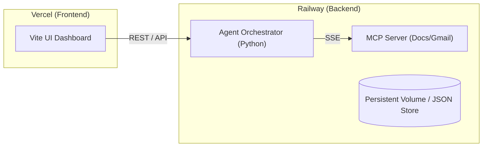

# Deployment Plan: Groww Weekly User Feedback Intelligence AI Agent

**Version:** 1.0  
**Derived from:** `problemStatement.md`, `architecture.md`, `implementationPlan.md`  
**Last updated:** 2026-09-06

---

## 1. Executive Summary

This document outlines the deployment strategy for the Groww Weekly User Feedback Intelligence AI Agent. The architecture consists of a Python-based intelligent backend (Agent Orchestrator, Analysis Pipeline, MCP delivery) and a Vite-based (React/Vue) Frontend UI Dashboard. 

To achieve a scalable, low-maintenance, and cost-effective infrastructure, the deployment is split across two platforms:
- **Backend (Python AI Agent & MCP Server):** Deployed on **Railway**
- **Frontend (Vite Dashboard):** Deployed on **Vercel**

---

## 2. Infrastructure Architecture

---

## 3. Backend Deployment (Railway)

The backend encompasses the Core Agent (Collection, Processing, Analysis, Generation) and the external MCP server integrations (Google Docs, Gmail). Railway is chosen for its native Docker support, easy background worker management, and built-in persistent volumes.

### 3.1 Pre-requisites
- A Railway account connected to the project's GitHub repository.
- Required Environment Variables defined:
  - `GROQ_API_KEY`: For LLM analysis.
  - `GROWW_AGENT_MCP_SERVER_URL`: Local or railway-internal URL.
  - `GROWW_AGENT_MCP_API_KEY`: Authentication for MCP.
  - Google Workspace credentials for the MCP Server.

### 3.2 Deployment Steps
1. **Service Creation:** Create a new Railway project and provision two services if needed (Agent Orchestrator and MCP Server), or combine them if running in a single container.
2. **Persistent Storage:** Attach a Railway Volume to the Agent service mapped to `/app/data` to persist JSON store data (e.g., historical aggregates, collection state).
3. **Build Configuration:** 
   - Utilize a `Dockerfile` to install Python 3.10+, `requirements.txt`, and system dependencies.
   - Alternatively, use Railway's Nixpacks for zero-config Python deployments.
4. **Execution Command:** 
   - The Agent may run as a long-running process serving an API for the frontend, or as a background worker triggered via `cron`.
   - Command: `python -m src` or `uvicorn src.api:app --host 0.0.0.0 --port $PORT`
5. **Environment Variables:** Map the production `.env` variables into the Railway project variables.

### 3.3 MCP Server (SSE)
Since the architecture relies on an external MCP server for Google Docs and Gmail (communicating via SSE), this can be deployed as a separate Railway service within the same project network, ensuring secure, fast internal communication.

---

## 4. Frontend Deployment (Vercel)

The frontend is a Vite-based web dashboard (integrating Google Stitch components) providing a visual interface over the analysis outputs.

### 4.1 Pre-requisites
- A Vercel account connected to the project's GitHub repository.
- Build settings configured for Vite.
- Environment Variables:
  - `VITE_API_BASE_URL`: Pointing to the Railway backend public URL.

### 4.2 Deployment Steps
1. **Import Project:** Import the repository into Vercel.
2. **Framework Preset:** Select Vite (or let Vercel auto-detect).
3. **Root Directory:** If the frontend is in a subdirectory (e.g., `frontend/`), set the Root Directory accordingly.
4. **Build & Output:**
   - Build Command: `npm run build`
   - Output Directory: `dist`
5. **Deploy:** Trigger the initial deployment. Vercel will automatically provide a global CDN, SSL, and a custom `vercel.app` domain.

---

## 5. CI/CD & Automation

1. **Version Control Integration:**
   - Both Railway and Vercel will trigger automatic deployments on pushes to the `main` branch.
2. **Testing Gate:**
   - Set up GitHub Actions to run `pytest` and linters before allowing merges to `main`.
3. **Scheduling:**
   - Use a GitHub Actions workflow (`.github/workflows/schedule.yml`) with a cron trigger (e.g., `0 0 * * 1`) to execute the agent schedule. The GitHub Action will run the pipeline and persist the resulting JSON data back to the repository, which will automatically trigger a Vercel rebuild for the frontend.

---

## 6. Security & Environment Management

- **Secrets Management:** Use Vercel and Railway's native secret management. Do NOT commit `.env` files.
- **CORS:** Ensure the Railway backend CORS policy strictly allows requests only from the Vercel frontend domain.
- **Network Isolation:** Internal MCP communication on Railway should use private networking (`railway.internal`), preventing public exposure of the MCP SSE endpoints.
- **PII:** The agent is designed to minimize PII; ensure logs stored in Railway do not leak sensitive reviewer information.

---

## 7. Post-Deployment Verification

After the initial deployment, perform the following checks:
1. [ ] **Frontend Accessibility:** Verify the Vercel domain is live and loads the dashboard.
2. [ ] **Backend Health:** Check Railway logs to confirm the Agent initialized without errors.
3. [ ] **Integration Test:** Manually trigger a "Pulse Generation" run via the dashboard or CLI.
4. [ ] **Data Persistence:** Verify that the run history and extracted themes are persisted in the Railway volume.
5. [ ] **Delivery Verification:** Check that the Google Doc was created/appended and the Gmail draft was successfully generated via the MCP server.
