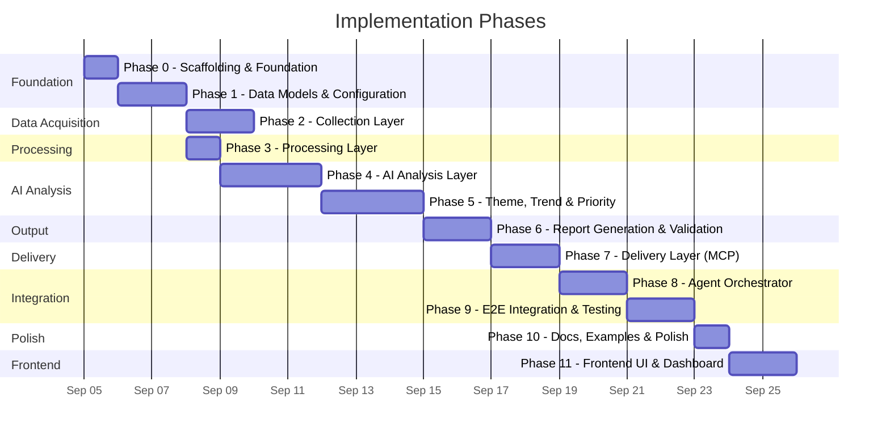
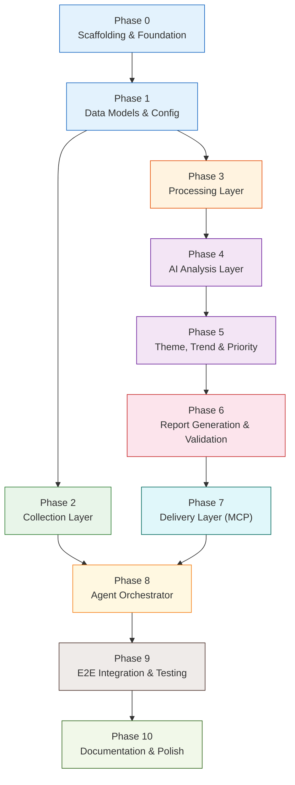

# Implementation Plan: Groww Weekly User Feedback Intelligence AI Agent

**Version:** 1.0  
**Derived from:** [problemStatement.md](file:///d:/GenAI/Practice/Pranju/GROW_review_analysis_agent/docs/problemStatement.md) | [architecture.md](file:///d:/GenAI/Practice/Pranju/GROW_review_analysis_agent/docs/architecture.md)  
**Last updated:** 2026-09-05

---

## Table of Contents

1. [Implementation Strategy](#1-implementation-strategy)
2. [Phase Overview & Timeline](#2-phase-overview--timeline)
3. [Phase 0 — Project Scaffolding & Foundation](#3-phase-0--project-scaffolding--foundation)
4. [Phase 1 — Data Models & Configuration](#4-phase-1--data-models--configuration)
5. [Phase 2 — Collection Layer](#5-phase-2--collection-layer)
6. [Phase 3 — Processing Layer](#6-phase-3--processing-layer)
7. [Phase 4 — AI Analysis Layer](#7-phase-4--ai-analysis-layer)
8. [Phase 5 — Theme, Trend & Priority Engine](#8-phase-5--theme-trend--priority-engine)
9. [Phase 6 — Report Generation & Validation](#9-phase-6--report-generation--validation)
10. [Phase 7 — Delivery Layer (MCP Integration)](#10-phase-7--delivery-layer-mcp-integration)
11. [Phase 8 — Agent Orchestrator](#11-phase-8--agent-orchestrator)
12. [Phase 9 — End-to-End Integration & Testing](#12-phase-9--end-to-end-integration--testing)
13. [Phase 10 — Documentation, Examples & Polish](#13-phase-10--documentation-examples--polish)
14. [Phase 11 — Frontend UI & Dashboard Integration](#14-phase-11--frontend-ui--dashboard-integration)
15. [Dependency Graph](#15-dependency-graph)
16. [Risk Register](#16-risk-register)
17. [Definition of Done per Phase](#17-definition-of-done-per-phase)

---

## 1. Implementation Strategy

### 1.1 Guiding Principles

| Principle | Description |
|---|---|
| **Bottom-up layering** | Build foundational models and utilities first, then components that depend on them |
| **Test as you go** | Each phase includes its own unit tests — never defer all testing to the end |
| **Vertical slices** | Each phase produces a runnable, testable slice of functionality |
| **Incremental integration** | Components are wired together progressively — Phase 8 ties them into the full agent |
| **Fail fast, fail visible** | Error handling and logging are baked in from Phase 0, not bolted on at the end |
| **Fixtures before live data** | Analysis and generation phases work against fixture data before needing the live collection layer |

### 1.2 Technology Decisions

| Choice | Technology | Rationale |
|---|---|---|
| Language | **Python 3.10+** | Rich ecosystem for NLP, LLM SDKs, and scraping |
| Data models | **Pydantic v2** | Type-safe, validated, JSON-serializable models |
| Config management | **python-dotenv** + **PyYAML** + **Pydantic Settings** | Layered config with env variable overrides |
| Review scraping | **google-play-scraper** | Most mature Python library for public Play Store reviews |
| LLM integration | **groq** (Groq SDK) | Matches the architecture's default model choice |
| Testing | **pytest** + **pytest-asyncio** | Industry standard; async support if needed |
| Logging | **Python `logging`** + **structlog** | Structured JSON logging with minimal dependencies |
| CLI | **argparse** or **click** | Simple CLI; no heavy framework needed |
| Storage (MVP) | **JSON file store** | Zero-dependency persistence for Phase 0 |
| Fuzzy dedup | **rapidfuzz** | Fast C-based fuzzy string matching |
| Package management | **pip** + **pyproject.toml** | Standard Python packaging |

---

## 2. Phase Overview & Timeline



### Phase Summary Table

| Phase | Name | Key Deliverables | Estimated Effort |
|---|---|---|---|
| **0** | Project Scaffolding & Foundation | Repo structure, dependencies, logger, `.gitignore`, `pyproject.toml` | 0.5–1 day |
| **1** | Data Models & Configuration | All Pydantic models, enums, config schema, config manager | 1–2 days |
| **2** | Collection Layer | Google Play adapter, incremental manager, collection tests | 1–2 days |
| **3** | Processing Layer | Normalizer, deduplicator, processing tests | 1 day |
| **4** | AI Analysis Layer | LLM classifier + sentiment, prompt templates, batch processing | 2–3 days |
| **5** | Theme, Trend & Priority Engine | Theme discovery, trend analysis, priority scoring, evidence selection | 2–3 days |
| **6** | Report Generation & Validation | Pulse generator, report validator, output formatting | 1–2 days |
| **7** | Delivery Layer (MCP) | Google Docs adapter, Gmail adapter, MCP mocks | 1–2 days |
| **8** | Agent Orchestrator | Orchestrator, CLI, agentic decision logic, partial-failure handling | 1–2 days |
| **9** | E2E Integration & Testing | Full pipeline tests, failure-path tests, fixture-based E2E | 1–2 days |
| **10** | Documentation, Examples & Polish | README, sample pulse, sample draft, env docs, reuse guide | 1 day |
| **11** | Frontend UI & Dashboard Integration | Integrate Vite frontend and Stitch components, wire up API | 2 days |
| | **Total estimated** | | **~14–22 days** |

---

## 3. Phase 0 — Project Scaffolding & Foundation

### Objective
Establish the project skeleton, install dependencies, and set up cross-cutting infrastructure (logging, directory structure, package metadata) so all subsequent phases can build on a solid foundation.

### Tasks

#### 0.1 Initialize project structure
Create the full directory tree as defined in [architecture.md § 16](file:///d:/GenAI/Practice/Pranju/GROW_review_analysis_agent/docs/architecture.md):

```
GROW_review_analysis_agent/
├── src/
│   ├── __init__.py
│   ├── __main__.py
│   ├── agent/          (__init__.py)
│   ├── collection/     (__init__.py)
│   ├── processing/     (__init__.py)
│   ├── analysis/       (__init__.py)
│   ├── generation/     (__init__.py)
│   ├── delivery/       (__init__.py)
│   ├── storage/        (__init__.py)
│   ├── models/         (__init__.py)
│   ├── prompts/        (__init__.py)
│   ├── config/         (__init__.py)
│   └── observability/  (__init__.py)
├── tests/
│   ├── __init__.py
│   ├── unit/
│   ├── integration/
│   ├── e2e/
│   └── fixtures/
├── data/               (gitignored)
├── examples/
└── docs/
```

#### 0.2 Create `pyproject.toml`
Define project metadata, Python version requirement (≥3.10), and dependencies.

#### 0.3 Create `requirements.txt`
```
pydantic>=2.0
pydantic-settings>=2.0
python-dotenv>=1.0
pyyaml>=6.0
google-play-scraper>=1.2
groq>=0.5
structlog>=23.0
rapidfuzz>=3.0
click>=8.0
pytest>=7.0
pytest-cov>=4.0
```

#### 0.4 Create `.gitignore`
Exclude `data/`, `.env`, `__pycache__/`, `.pytest_cache/`, `*.pyc`, `dist/`, `*.egg-info/`.

#### 0.5 Create `.env.example`
Template with all environment variables (no real values).

#### 0.6 Implement Structured Logger (`src/observability/logger.py`)
- Initialize `structlog` with JSON formatting.
- Support configurable log level.
- Implement `run_id` context binding (all log entries include the run_id).
- Implement PII sanitization filter.
- Factory function: `get_logger(component: str) → BoundLogger`.

#### 0.7 Create placeholder `__main__.py`
Minimal CLI entry point that prints version and exits — to be expanded in Phase 8.

### Files Created

| File | Purpose |
|---|---|
| `pyproject.toml` | Project metadata and build config |
| `requirements.txt` | Python dependencies |
| `.gitignore` | Git exclusions |
| `.env.example` | Environment variable template |
| `src/__init__.py` | Package root |
| `src/__main__.py` | CLI entry point (placeholder) |
| `src/observability/__init__.py` | Package init |
| `src/observability/logger.py` | Structured logger with run_id and PII sanitization |
| All `__init__.py` files | Package markers for every sub-package |

### Tests
- `tests/unit/test_logger.py` — Verify JSON output, PII sanitization, run_id propagation.

### Exit Criteria
- [x] `python -m src` runs without error and prints version.
- [x] Logger produces structured JSON output with run_id.
- [x] All packages importable.
- [x] `pytest` discovers and runs logger tests.

---

## 4. Phase 1 — Data Models & Configuration

### Objective
Define all Pydantic data models, enumerations, and the configuration management system. These are the foundational types that every other component depends on.

### Tasks

#### 1.1 Implement Enumerations (`src/models/enums.py`)
All enums from [architecture.md § 5.2](file:///d:/GenAI/Practice/Pranju/GROW_review_analysis_agent/docs/architecture.md):
- `Sentiment` (POSITIVE, NEUTRAL, NEGATIVE, MIXED)
- `PriorityLevel` (CRITICAL, HIGH, MEDIUM, LOW)
- `SeverityLevel` (CRITICAL, HIGH, MEDIUM, LOW, INFORMATIONAL)
- `TrendType` (NEW, GROWING, DECLINING, PERSISTENT)
- `CollectionStatus` (SUCCESS, PARTIAL, FAILED)
- `ReviewCategory` (17 categories — PRAISE through OTHER)

#### 1.2 Implement Review Models (`src/models/review.py`)
Based on [architecture.md § 5.1](file:///d:/GenAI/Practice/Pranju/GROW_review_analysis_agent/docs/architecture.md):
- `RawReview` — all fields from Google Play (review_id, app_id, source, reviewer_name, review_text, star_rating, review_date, developer_reply, detected_language, app_version, source_url, collected_at).
- `NormalizedReview` — original_text, cleaned_text, detected_language, is_usable, content_hash, normalization_notes.
- `AnalyzedReview` — sentiment, sentiment_confidence, categories[], product_area, severity, intent, key_phrases[].
- `ReviewExcerpt` — displayed_text, original_text, is_truncated, review_date, star_rating, source_review_id, theme_id.
- Helper models: `CollectionResult`, `CollectionMetadata`, `CollectionError`, `NormalizationResult`, `NormalizationStats`, `DeduplicationResult`, `DedupRecord`.

#### 1.3 Implement Theme Models (`src/models/theme.py`)
- `Theme` — id, name, description, review_count, review_percentage, sentiment_distribution, product_area, severity, is_recurring, is_emerging, recommended_action.
- `PrioritizedTheme` — theme, priority, score, factor_breakdown, rationale.
- `TrendSignal` — theme, trend_type, evidence, interpretation, recommendation, volume_change_pct, sentiment_change.
- `TrendResult` — emerging/growing/declining/persistent/new theme lists, comparison_period, data_availability_note.
- `SentimentDistribution` — positive_count, neutral_count, negative_count, mixed_count, percentages.
- `SentimentShift` — previous, current, delta.

#### 1.4 Implement Pulse Models (`src/models/pulse.py`)
Matching [problemStatement.md § 6](file:///d:/GenAI/Practice/Pranju/GROW_review_analysis_agent/docs/problemStatement.md):
- `WeeklyPulse` — top-level container with all 10 sections.
- `ExecutiveSummary` — bullets[].
- `WeekMetrics` — reviews_analyzed, avg_star_rating, sentiment_distribution, theme_count, emerging_count, critical_high_count, rating_distribution.
- `ThemeSection` — per-theme breakdown.
- `PositiveFinding`, `PainPoint`, `EmergingSignal`, `FeatureRequest`, `ActionItem`.
- `MethodologySection` — source, app_id, period, timestamp, counts, limitations.
- `WeeklyAggregate` — run_id, app_id, period, metrics, themes, doc_url, gmail_status.

#### 1.5 Implement Configuration Models (`src/models/config.py`)
- `AppConfig` — name, package_id, store, play_store_url.
- `CollectionConfig` — max_reviews, min_review_threshold, reporting_period_days, historical_comparison_periods, pagination_limit.
- `AnalysisConfig` — llm_model, llm_temperature, batch_size, max_retries, retry_backoff_seconds, custom_categories.
- `PriorityConfig` — weights (dict), thresholds (dict).
- `DeduplicationConfig` — exact_match, near_duplicate_threshold.
- `DeliveryConfig` — google_docs (GoogleDocsConfig), gmail (GmailConfig).
- `StorageConfig` — backend, data_dir.
- `LoggingConfig` — level, format, sanitize_pii.
- `SchedulingConfig` — (Deprecated, scheduling is managed via GitHub Actions).
- `AgentConfig` — top-level model combining all the above.

#### 1.6 Implement Configuration Manager (`src/config/manager.py`)
- Load from YAML file → merge with `.env` → merge with environment variables → apply defaults.
- Validate using Pydantic model validation.
- Provide a singleton `get_config() → AgentConfig` accessor.
- Support environment variable overrides (see [architecture.md § 10.3](file:///d:/GenAI/Practice/Pranju/GROW_review_analysis_agent/docs/architecture.md)).

#### 1.7 Create default `config.yaml` and Document Configuration Hierarchy
Full configuration file with sensible defaults as defined in [architecture.md § 10.2](file:///d:/GenAI/Practice/Pranju/GROW_review_analysis_agent/docs/architecture.md).

**Configuration Strategy (`config.yaml` vs `.env`):**

1. **`config.yaml` (Base Defaults & Structure)**  
   Safely committed to version control. Defines the default behavior of the agent across all environments. Sensitive keys (like `api_key`) should be left blank.
   - **App Settings**: `app.name`, `app.package_id`, `app.play_store_url`
   - **Collection**: `collection.max_reviews`, `collection.min_review_threshold`, `collection.reporting_period_days`, `collection.historical_comparison_periods`
   - **Analysis**: `analysis.llm_model`, `analysis.llm_temperature`, `analysis.batch_size`, `analysis.sentiment_labels`, `analysis.custom_categories`
   - **Priority & Deduplication**: Weights, thresholds, and exact/near matching configs.
   - **Storage & Logging**: `storage.data_dir`, `logging.level`, `logging.format`
   - **Delivery Options**: `delivery.mcp.server_url`, `delivery.mcp.api_key` (empty), Gmail/Docs placeholders.

2. **`.env` (Secrets & Environment Overrides)**  
   Excluded from version control. Stores API keys and local developer overrides that replace `config.yaml` values.
   - **Secrets (Required)**: `GROQ_API_KEY`, `GROWW_AGENT_MCP_API_KEY`
   - **Environment Overrides (Optional)**:
     - `GROWW_AGENT_MCP_SERVER_URL` (Override MCP URL for local testing)
     - `GROWW_AGENT_APP_ID` (Override package ID)
     - `GROWW_AGENT_LLM_MODEL` (Override LLM model)
     - `GROWW_AGENT_LOG_LEVEL` (Override log level, e.g., DEBUG)
     - `GROWW_AGENT_DATA_DIR` (Override storage path)
     - `GROWW_AGENT_GOOGLE_DOC_ID`, `GROWW_AGENT_GMAIL_RECIPIENTS` (Delivery targets)
     - `GROWW_AGENT_CONFIG_PATH` (Custom path for config.yaml)

#### 1.8 Implement Storage Interface (`src/storage/base_store.py`)
Define the `StorageBackend` protocol (abstract base):
- `save_raw_reviews()`, `save_normalized_reviews()`, `save_analysis_results()`
- `save_themes()`, `save_weekly_aggregate()`, `save_collection_metadata()`
- `get_previous_aggregate()`, `get_processed_review_ids()`, `get_run_history()`
- `save_error_log()`

#### 1.9 Implement JSON File Store (`src/storage/json_file_store.py`)
Concrete implementation of `StorageBackend` using JSON files:
- Directory structure as per [architecture.md § 9.2](file:///d:/GenAI/Practice/Pranju/GROW_review_analysis_agent/docs/architecture.md).
- Auto-create directories on first use.
- Atomic writes (write to temp file, then rename).
- Load/save helpers with Pydantic model serialization.

### Files Created

| File | Purpose |
|---|---|
| `src/models/enums.py` | All enumerations |
| `src/models/review.py` | Review-lifecycle models (raw → normalized → analyzed) |
| `src/models/theme.py` | Theme, trend, and priority models |
| `src/models/pulse.py` | Weekly pulse output models |
| `src/models/config.py` | Configuration data models |
| `src/config/manager.py` | Configuration loading and validation |
| `config.yaml` | Default configuration file |
| `src/storage/base_store.py` | Abstract storage protocol |
| `src/storage/json_file_store.py` | JSON file store implementation |

### Tests
- `tests/unit/test_models.py` — Validation, serialization/deserialization, edge cases.
- `tests/unit/test_config_manager.py` — YAML loading, env overrides, defaults, invalid config.
- `tests/unit/test_json_file_store.py` — Save/load cycles, directory creation, atomic writes.

### Test Fixtures
- `tests/fixtures/sample_reviews.json` — 20–30 sample raw reviews (diverse ratings, categories).
- `tests/fixtures/sample_config.yaml` — Test configuration.

### Exit Criteria
- [x] All models import and validate correctly.
- [x] Config manager loads from YAML + env vars and produces a valid `AgentConfig`.
- [x] JSON file store can save and retrieve all model types.
- [x] Fixture data loads and parses without errors.
- [x] All tests pass.

---

## 5. Phase 2 — Collection Layer

### Objective
Implement the Google Play Store review collection pipeline, including the source adapter abstraction, the concrete Google Play implementation, and the incremental collection manager.

### Tasks

#### 2.1 Implement Review Source Adapter Protocol (`src/collection/base_adapter.py`)
Abstract protocol as per [architecture.md § 4.2](file:///d:/GenAI/Practice/Pranju/GROW_review_analysis_agent/docs/architecture.md):
- `fetch_reviews(app_id, date_range, max_count) → CollectionResult`
- `get_source_name() → str`
- `supports_incremental() → bool`

#### 2.2 Implement Google Play Review Adapter (`src/collection/google_play_adapter.py`)
Concrete implementation using `google-play-scraper`:
- Fetch reviews for a given app package ID.
- Support pagination (continuation tokens).
- Map scraper output to `RawReview` models.
- Filter by date range.
- Handle rate limits with retry + exponential backoff.
- Handle network errors gracefully.
- Return `CollectionResult` with reviews, metadata, and failure details.
- Respect the configurable `max_reviews` limit.

**Key implementation details:**
```python
from google_play_scraper import Sort, reviews

def fetch_reviews(self, app_id, date_range, max_count):
    # Use google_play_scraper.reviews() with continuation_token
    # Filter by date range post-fetch
    # Map to RawReview models
    # Track pagination and source coverage
```

#### 2.3 Implement Incremental Collection Manager (`src/collection/incremental_manager.py`)
- Load previous collection state from storage.
- Determine which reviews are new (not in `processed_review_ids`).
- Generate content hashes for reviews without stable IDs.
- Update state after successful collection.
- Record collection status and failures.

#### 2.4 Implement date range utility
Helper for computing the previous week's date range:
- `get_last_complete_week() → DateRange` (Monday 00:00 to Sunday 23:59).
- `get_date_range(start, end) → DateRange` (explicit range).

### Files Created

| File | Purpose |
|---|---|
| `src/collection/base_adapter.py` | Abstract ReviewSourceAdapter protocol |
| `src/collection/google_play_adapter.py` | Google Play Store scraping implementation |
| `src/collection/incremental_manager.py` | Incremental collection state management |

### Tests
- `tests/unit/test_google_play_adapter.py` — Mock `google_play_scraper` responses, test mapping, pagination, date filtering, error handling.
- `tests/unit/test_incremental_manager.py` — State load/save, new review detection, hash generation.
- `tests/integration/test_collection_pipeline.py` — Adapter → Incremental Manager → Storage (using mocks for the scraper).

### Exit Criteria
- [x] Google Play adapter fetches and maps reviews to `RawReview` models (verified with mocked scraper).
- [x] Incremental manager correctly identifies new vs. already-processed reviews.
- [x] Collection state persists across simulated runs.
- [x] Error handling covers network failures, rate limits, and empty responses.
- [x] All tests pass.

---

## 6. Phase 3 — Processing Layer

### Objective
Implement the pre-AI data cleaning pipeline: normalization and deduplication. These components prepare raw reviews for LLM analysis.

### Tasks

#### 3.1 Implement Review Normalizer (`src/processing/normalizer.py`)
As per [architecture.md § 4.4](file:///d:/GenAI/Practice/Pranju/GROW_review_analysis_agent/docs/architecture.md) and [problemStatement.md § 5.3](file:///d:/GenAI/Practice/Pranju/GROW_review_analysis_agent/docs/problemStatement.md):

- **Whitespace normalization** — collapse multiple spaces/newlines, strip leading/trailing.
- **Unicode normalization** — NFC form, handle invisible characters.
- **Emoji handling** — preserve emojis (they carry sentiment) but normalize surrounding whitespace.
- **Language detection** — use a lightweight detector (e.g., `langdetect` or character-set heuristics).
- **Empty/unusable review filtering** — flag reviews that are blank, too short (<5 chars), or contain only emojis/punctuation.
- **Domain term preservation** — protect terms like "KYC", "IPO", "MF", "SIP", "OTP", "UPI", "SGB", "FD", "NPS" from being altered.
- **Original text preservation** — always store `original_text` alongside `cleaned_text`.
- **Content hash generation** — SHA-256 of `(cleaned_text + star_rating + reviewer_name)` for dedup.
- `normalize_batch(reviews) → NormalizationResult` with stats.

#### 3.2 Implement Deduplication Service (`src/processing/deduplicator.py`)
As per [architecture.md § 4.5](file:///d:/GenAI/Practice/Pranju/GROW_review_analysis_agent/docs/architecture.md):

- **Exact dedup** — match on content hash.
- **Near-duplicate detection** — use `rapidfuzz` for fuzzy matching with configurable threshold (default: 0.85 Jaccard similarity on cleaned text).
- **Cross-period dedup** — check against `processed_review_ids` from the incremental manager.
- Return `DeduplicationResult` with unique reviews, removal counts, and details.

**Implementation approach:**
```python
# Exact: group by content_hash, keep first occurrence
# Near: pairwise comparison within each hash-bucket miss group
#        using rapidfuzz.fuzz.ratio > threshold
# Cross-period: filter out any review whose ID or hash is in historical set
```

### Files Created

| File | Purpose |
|---|---|
| `src/processing/normalizer.py` | Review text normalization and cleaning |
| `src/processing/deduplicator.py` | Exact and near-duplicate removal |

### Tests
- `tests/unit/test_normalizer.py`:
  - Whitespace normalization (tabs, newlines, double spaces).
  - Unicode edge cases.
  - Emoji preservation.
  - Empty/unusable review detection.
  - Domain term protection (KYC, IPO remain unchanged).
  - Language detection.
  - Original text preservation.
  - Content hash determinism.
- `tests/unit/test_deduplicator.py`:
  - Exact duplicate removal.
  - Near-duplicate detection with threshold testing.
  - Cross-period dedup with historical ID set.
  - Edge cases: single review, all duplicates, no duplicates.

### Exit Criteria
- [x] Normalizer produces clean, consistent output while preserving original text.
- [x] Domain terms survive normalization unchanged.
- [x] Deduplicator removes exact and near duplicates correctly.
- [x] Cross-period dedup filters previously-processed reviews.
- [x] Empty/unusable reviews are flagged, not silently dropped.
- [x] All tests pass.

---

## 7. Phase 4 — AI Analysis Layer

### Objective
Implement the LLM-powered review classification and sentiment analysis (Stage 1 of the AI pipeline). This is the core intelligence component that processes each review individually.

### Tasks

#### 4.1 Implement LLM Client Wrapper
Thin wrapper around `groq` SDK:
- Configure model, temperature, max tokens from `AgentConfig`.
- Support structured JSON output (response schema).
- Implement retry with exponential backoff for transient failures.
- Handle rate limits, timeouts, and malformed responses.
- Log all LLM calls with timing, token usage, and run_id.

#### 4.2 Implement Classification Prompt Template (`src/prompts/classification_prompt.py`)
As per [architecture.md § 8.3](file:///d:/GenAI/Practice/Pranju/GROW_review_analysis_agent/docs/architecture.md):

- System prompt establishing the role (review analyst).
- Anti-hallucination instructions.
- Extensible category taxonomy (from config).
- Sentiment labels with definitions.
- Severity level definitions.
- Output schema (JSON):
  ```json
  {
    "review_id": "...",
    "categories": ["complaint", "performance_issue"],
    "sentiment": "negative",
    "sentiment_confidence": 0.92,
    "product_area": "trading",
    "severity": "high",
    "intent": "report_bug",
    "key_phrases": ["app crashes", "during market hours"]
  }
  ```
- Batch prompt template (20–50 reviews per call).

#### 4.3 Implement Review Analysis Service (`src/analysis/classifier.py`)
As per [architecture.md § 4.6](file:///d:/GenAI/Practice/Pranju/GROW_review_analysis_agent/docs/architecture.md):

- `analyze_batch(reviews: List[NormalizedReview]) → List[AnalyzedReview]`
- Batch reviews into groups of `config.analysis.batch_size`.
- For each batch:
  - Implement payload optimization by stripping `NormalizedReview` down to `review_id`, `cleaned_text`, and `star_rating` before sending to the LLM to minimize token usage and allow larger batch sizes (e.g., 30).
  - Construct the prompt with the optimized batch reviews.
  - Call the LLM.
  - Parse the structured JSON response.
  - Validate against the Pydantic `AnalyzedReview` model.
  - Handle partial batch failures (retry individual reviews if batch fails).
- Aggregate results across batches.
- Log: total analyzed, batch count, duration, any failures.

#### 4.4 Create classification test fixtures
- `tests/fixtures/sample_reviews.json` — Expand to 30+ reviews covering all categories.
- `tests/fixtures/sample_analyzed.json` — Expected analysis output for fixture reviews.

### Files Created

| File | Purpose |
|---|---|
| `src/analysis/__init__.py` | Package init |
| `src/analysis/classifier.py` | Review classification + sentiment analysis service |
| `src/prompts/classification_prompt.py` | Stage 1 LLM prompt template |

### Tests
- `tests/unit/test_classifier.py`:
  - Prompt construction with varying batch sizes.
  - Response parsing with valid JSON.
  - Handling of malformed LLM output.
  - Batch splitting logic.
  - Retry on LLM failure.
  - Multi-category classification.
  - Sentiment confidence validation.
  - **Use mocked LLM responses** — no live API calls in unit tests.
- Manual validation (non-automated):
  - Run classifier against 30 fixture reviews with live LLM.
  - Spot-check classification accuracy.

### Exit Criteria
- [x] Classifier processes batches of normalized reviews and returns `AnalyzedReview` objects.
- [x] Prompt template is well-structured with anti-hallucination guards.
- [x] LLM responses are parsed and validated via Pydantic.
- [x] Retry logic handles transient LLM failures.
- [x] Batch failures don't lose the entire batch — individual retry attempted.
- [x] All tests pass with mocked LLM.

---

## 8. Phase 5 — Theme, Trend & Priority Engine

### Objective
Implement the corpus-level analysis components: theme discovery, trend analysis, priority scoring, and evidence selection. These represent Stages 2–3 of the AI pipeline.

### Tasks

#### 5.1 Implement Theme Discovery Prompt (`src/prompts/theme_discovery_prompt.py`)
Stage 2 prompt as per [architecture.md § 8.4](file:///d:/GenAI/Practice/Pranju/GROW_review_analysis_agent/docs/architecture.md):
- Input: all `AnalyzedReview` JSON summaries (categories, sentiment, key phrases).
- Instructions: discover organic themes from the data, not just predefined categories.
- Output schema: list of `Theme` objects with stats.
- Anti-hallucination: only use data from supplied reviews.

#### 5.2 Implement Theme Discovery Service (`src/analysis/theme_discovery.py`)
As per [architecture.md § 4.7](file:///d:/GenAI/Practice/Pranju/GROW_review_analysis_agent/docs/architecture.md):
- `discover_themes(reviews: List[AnalyzedReview], config) → ThemeResult`
- Feed all analyzed reviews to the theme discovery prompt.
- Parse LLM response into `Theme` objects.
- Calculate per-theme statistics:
  - Review count and percentage.
  - Sentiment distribution (from individual review sentiments).
  - Product area (aggregated from reviews).
  - Severity (highest severity in theme).
- Assign review-to-theme mappings.
- Handle unthemed reviews.

#### 5.3 Implement Trend Analysis Prompt (`src/prompts/trend_analysis_prompt.py`)
Stage 3 prompt:
- Input: current themes + historical `WeeklyAggregate` (if available).
- Instructions: compare current with previous period, identify trends.
- Output schema: `TrendResult` with trend signals.
- Explicit separation: observed evidence vs. interpretation vs. recommendation.

#### 5.4 Implement Trend Analysis Service (`src/analysis/trend_analysis.py`)
As per [architecture.md § 4.8](file:///d:/GenAI/Practice/Pranju/GROW_review_analysis_agent/docs/architecture.md):
- `analyze_trends(current: ThemeResult, historical: List[WeeklyAggregate] | None) → TrendResult`
- When historical data exists:
  - Compare theme names/topics using fuzzy matching.
  - Calculate volume change percentages.
  - Detect sentiment shifts.
  - Identify new themes (no historical match).
  - Identify growing/declining/persistent patterns.
- When historical data is absent:
  - Return `TrendResult` with `data_availability_note` explaining absence.
  - Still classify themes as NEW (first observation).
- Feed comparison data to the trend analysis prompt for AI-assisted interpretation.

#### 5.5 Implement Priority Scoring Service (`src/analysis/priority_scoring.py`)
As per [architecture.md § 4.9](file:///d:/GenAI/Practice/Pranju/GROW_review_analysis_agent/docs/architecture.md):
- `score_themes(themes, trends, config) → List[PrioritizedTheme]`
- Multi-factor scoring with configurable weights:

  | Factor | Weight | Computation |
  |---|---|---|
  | Frequency | 0.20 | `theme.review_count / total_reviews` |
  | Negative sentiment | 0.20 | `negative_count / theme.review_count` |
  | Severity language | 0.15 | Max severity in theme (CRITICAL=1.0 → LOW=0.25) |
  | Recency | 0.10 | Fraction of reviews from last 2 days |
  | Growth | 0.15 | `volume_change_pct` from trend signal (0 if no history) |
  | Breadth | 0.10 | Distinct reviewers / total reviewers |
  | Business impact | 0.10 | LLM-estimated (or heuristic based on product area) |

- Map composite score to `PriorityLevel` using configurable thresholds.
- Generate `factor_breakdown` dict and human-readable `rationale`.

#### 5.6 Implement Evidence Selection Service (`src/analysis/evidence_selection.py`)
As per [architecture.md § 4.10](file:///d:/GenAI/Practice/Pranju/GROW_review_analysis_agent/docs/architecture.md):
- `select_evidence(themes, max_per_theme, max_overall) → EvidenceResult`
- For each theme, select the most representative reviews:
  - Score by: clarity, representativeness, recency, uniqueness.
  - Prefer reviews that explain the underlying problem.
  - Avoid repetition across themes.
- Truncate long reviews with "…" indicator (`is_truncated=True`).
- Strip reviewer names for PII minimization.
- Select top overall "voice" excerpts for the curated section.
- **Never fabricate or paraphrase** — exact text only.

### Files Created

| File | Purpose |
|---|---|
| `src/analysis/theme_discovery.py` | Theme clustering and discovery |
| `src/analysis/trend_analysis.py` | Week-over-week trend detection |
| `src/analysis/priority_scoring.py` | Multi-factor priority scoring |
| `src/analysis/evidence_selection.py` | Representative quote selection |
| `src/prompts/theme_discovery_prompt.py` | Stage 2 LLM prompt |
| `src/prompts/trend_analysis_prompt.py` | Stage 3 LLM prompt |

### Test Fixtures
- `tests/fixtures/sample_analyzed.json` — 30+ analyzed reviews (from Phase 4 fixture).
- `tests/fixtures/sample_themes.json` — Expected theme discovery output.
- `tests/fixtures/sample_historical_aggregate.json` — Previous week's aggregate for trend testing.

### Tests
- `tests/unit/test_theme_discovery.py` — Theme creation, stats calculation, unthemed handling (mocked LLM).
- `tests/unit/test_trend_analysis.py` — With/without historical data, volume change calculation, sentiment shift, new theme detection.
- `tests/unit/test_priority_scoring.py` — Score computation, weight application, threshold boundaries, factor breakdown.
- `tests/unit/test_evidence_selection.py` — Quote selection, truncation, PII stripping, diversity, max limits.

### Exit Criteria
- [x] Theme discovery clusters reviews into meaningful, named themes with stats.
- [x] Trend analysis compares with historical data and produces accurate signals.
- [x] Trend analysis gracefully handles missing historical data.
- [x] Priority scoring produces transparent, reproducible scores with rationale.
- [x] Evidence selection returns exact, representative quotes without fabrication.
- [x] All tests pass.

---

## 9. Phase 6 — Report Generation & Validation

### Objective
Implement the Weekly Pulse Generator (assembling all analysis outputs into the final structured report) and the Report Validator (pre-publication quality gate).

### Tasks

#### 6.1 Implement Pulse Generation Prompt (`src/prompts/pulse_generation_prompt.py`)
Stage 4 prompt as per [architecture.md § 8.6](file:///d:/GenAI/Practice/Pranju/GROW_review_analysis_agent/docs/architecture.md):
- Input: themes, trends, priorities, evidence, metrics.
- Instructions: produce executive-quality prose for each pulse section.
- Output: structured `WeeklyPulse` content.
- Tone: concise, scannable, professionally formatted.

#### 6.2 Implement Weekly Pulse Generator (`src/generation/pulse_generator.py`)
As per [architecture.md § 4.11](file:///d:/GenAI/Practice/Pranju/GROW_review_analysis_agent/docs/architecture.md):

- `generate_pulse(context: AnalysisContext) → WeeklyPulse`
- `AnalysisContext` bundles all prior-stage outputs: analyzed reviews, themes, trends, priorities, evidence, metrics, config.
- Populate all 10 sections of the `WeeklyPulse`:

  | Section | Source Data |
  |---|---|
  | Executive Summary | Top themes, sentiment, key changes |
  | Week at a Glance | Aggregated metrics |
  | Top User Themes | PrioritizedThemes |
  | What Users Love | Positive-sentiment themes/findings |
  | Top Pain Points | High-severity negative themes |
  | Emerging Signals | TrendResult.emerging + new |
  | Feature Requests | Themes classified as FEATURE_REQUEST |
  | Representative Voice | EvidenceResult.top_voice_excerpts |
  | Recommended Actions | Per-theme + overall recommendations |
  | Methodology & Coverage | CollectionMetadata + config |

- Use the pulse generation prompt for executive summary and recommended actions (LLM-assisted prose).
- Use structured data directly for metrics, theme stats, and evidence sections.

#### 6.3 Implement Report Formatting Utilities
Helper functions for formatting the pulse into:
- **Markdown** (for local preview and Google Docs content).
- **HTML** (for Gmail draft body).
- **Plain text** (for Gmail draft fallback).

Each formatter takes a `WeeklyPulse` and produces formatted output.

#### 6.4 Implement Report Validator (`src/generation/report_validator.py`)
As per [architecture.md § 4.12](file:///d:/GenAI/Practice/Pranju/GROW_review_analysis_agent/docs/architecture.md):

- `validate(pulse: WeeklyPulse, context: AnalysisContext) → ValidationResult`
- Validation checks (each produces PASS/WARN/FAIL):

  | # | Check | Logic |
  |---|---|---|
  | 1 | Collection success | `context.collection_status != FAILED` |
  | 2 | Period correctness | Pulse period matches config period |
  | 3 | Minimum reviews | `total_analyzed >= config.min_review_threshold` |
  | 4 | Dedup applied | `dedup_count >= 0` (dedup ran) |
  | 5 | Theme count consistency | Sum of theme review counts ≈ total analyzed |
  | 6 | Percentage reconciliation | Theme percentages sum to ~100% (±5%) |
  | 7 | Quote verification | All excerpts exist in analyzed review source data |
  | 8 | Evidence grounding | Each recommendation cites supporting theme/data |
  | 9 | Trend data backing | Trend claims only present if historical data was available |
  | 10 | Section completeness | All 10 pulse sections are non-empty |

- Auto-correction for minor issues (e.g., recalculate percentages).
- Return `ValidationResult` with pass/warn/fail per check.

### Files Created

| File | Purpose |
|---|---|
| `src/generation/pulse_generator.py` | Weekly pulse document assembly |
| `src/generation/report_validator.py` | Pre-publication quality gate |
| `src/prompts/pulse_generation_prompt.py` | Stage 4 LLM prompt for prose sections |

### Tests
- `tests/unit/test_pulse_generator.py` — Section population, metrics aggregation, missing data handling.
- `tests/unit/test_report_validator.py` — Each of the 10 validation checks (pass and fail scenarios), auto-correction.

### Test Fixtures
- `tests/fixtures/sample_pulse.json` — Complete valid pulse for testing validation.
- `tests/fixtures/sample_pulse_invalid.json` — Pulse with deliberate validation failures.

### Exit Criteria
- [x] Pulse generator produces a complete `WeeklyPulse` from analysis context.
- [x] All 10 pulse sections are populated with correct data.
- [x] Formatter produces clean Markdown, HTML, and plain text output.
- [x] Report validator catches all specified validation failures.
- [x] Auto-correction works for minor issues.
- [x] All tests pass.

---

## 10. Phase 7 — Delivery Layer (MCP Integration)

### Objective
Implement the SSE MCP client and the Google Docs and Gmail adapters that deliver the weekly pulse to an external MCP server (e.g. Railway). Also implement mock MCP tools for testing.

### Tasks

#### 7.1 Implement MCP Client (`src/delivery/mcp_client.py`)
- Create an `MCPClient` class using the official `mcp.client.sse.sse_client`.
- Parse `server_url` and `api_key` from configuration.
- Connect to the remote MCP Server.

#### 7.2 Implement Google Docs MCP Adapter (`src/delivery/google_docs_adapter.py`)
As per [architecture.md § 4.13](file:///d:/GenAI/Practice/Pranju/GROW_review_analysis_agent/docs/architecture.md):

- `deliver_to_docs(pulse: WeeklyPulse, config: GoogleDocsConfig) → DeliveryResult`
- Operations:
  - **Create mode**: Call remote MCP `create_document` with title and formatted content.
  - **Append mode**: Call remote MCP `append_formatted_content` with doc_id, separator, and content.
- Format the `WeeklyPulse` into professional Docs content:
  - Headings (H1 for title, H2 for sections, H3 for themes).
  - Bullet lists for evidence and recommendations.
  - Tables for metrics.
  - Bold/emphasis for priorities and key findings.
  - Weekly separator between pulse entries.
- Return `DeliveryResult` with doc_url, success status, error details.
- Retry on transient MCP failures (up to 3 attempts).
- **Never overwrite** — always append or create new.

#### 7.3 Implement Gmail MCP Adapter (`src/delivery/gmail_adapter.py`)
As per [architecture.md § 4.14](file:///d:/GenAI/Practice/Pranju/GROW_review_analysis_agent/docs/architecture.md):

- `create_email_draft(pulse: WeeklyPulse, doc_url: str | None, config: GmailConfig) → DeliveryResult`
- Construct the email:
  - **Subject**: `Groww Weekly User Feedback Pulse – {start_date} to {end_date}`
  - **Body (HTML)**: Executive summary paragraph, top 3–7 findings (bullets), recommended actions, Doc link, methodology note.
  - **Body (plain text)**: Fallback text version.
- Call remote MCP `create_draft` tool.
- Handle case where `doc_url` is `None` (Docs failed — draft still created but notes absence of Doc link).
- Return `DeliveryResult` with draft_id, success status.
- DRAFT only — never send automatically.

#### 7.3 Create Delivery Result Model
```python
class DeliveryResult(BaseModel):
    surface: str             # "google_docs" | "gmail"
    success: bool
    doc_url: str | None
    draft_id: str | None
    error: str | None
    attempts: int
```

#### 7.4 Implement Mock MCP Tools (`tests/integration/mock_mcp_tools.py`)
For use in testing:
```python
class MockGoogleDocsMCP:
    def create_document(self, title, content): ...
    def append_formatted_content(self, doc_id, content, separator): ...
    def get_document_reference(self, doc_id): ...

class MockGmailMCP:
    def create_draft(self, to, subject, body_html, body_text): ...
```
- Record all calls for assertion in tests.
- Support configurable failure injection (simulate MCP failures).

### Files Created

| File | Purpose |
|---|---|
| `src/delivery/mcp_client.py` | SSE client for external MCP server |
| `src/delivery/google_docs_adapter.py` | Google Docs MCP integration |
| `src/delivery/gmail_adapter.py` | Gmail MCP integration |
| `tests/integration/mock_mcp_tools.py` | Mock MCP tools for testing |

### Tests
- `tests/unit/test_google_docs_adapter.py` — Content formatting, create vs. append, retry logic, failure handling.
- `tests/unit/test_gmail_adapter.py` — Email construction, subject/body formatting, missing doc_url handling.
- `tests/integration/test_delivery_pipeline.py` — Docs + Gmail delivery with mocked MCP tools, partial-failure matrix testing.

### Exit Criteria
- [x] Docs adapter formats and delivers pulse content via MCP (verified with mocks).
- [x] Gmail adapter creates well-formatted draft with executive summary.
- [x] Gmail adapter handles missing Doc URL gracefully.
- [x] Partial-failure matrix works correctly (Docs OK + Gmail fail, etc.).
- [x] Mock MCP tools support failure injection for testing.
- [x] All tests pass.

---

## 11. Phase 8 — Agent Orchestrator

### Objective
Implement the central Agent Orchestrator that ties all components together into an intelligent, agentic workflow. Also implement the CLI entry point.

### Tasks

#### 8.1 Implement Agent Orchestrator (`src/agent/orchestrator.py`)
As per [architecture.md § 4.1](file:///d:/GenAI/Practice/Pranju/GROW_review_analysis_agent/docs/architecture.md):

- `run(config: AgentConfig) → ExecutionReport`

**Orchestration logic (pseudo-code):**

```python
def run(self, config):
    run_id = generate_run_id()
    logger.bind(run_id=run_id)
    logger.info("run_started", config_summary=...)

    # 1. Collection
    collection_result = self.collector.fetch_reviews(...)
    if collection_result.status == FAILED:
        return self.report_failure("collection_failed", ...)

    # 2. Processing
    normalized = self.normalizer.normalize_batch(collection_result.reviews)
    deduped = self.deduplicator.deduplicate(normalized.normalized)

    if len(deduped.unique_reviews) < config.collection.min_review_threshold:
        logger.warning("low_review_count", ...)
        # Continue but flag in report

    # 3. Analysis
    analyzed = self.classifier.analyze_batch(deduped.unique_reviews)

    # 4. Theme Discovery
    themes = self.theme_discovery.discover_themes(analyzed)

    # 5. Trend Analysis (conditional)
    historical = self.storage.get_previous_aggregate(...)
    trends = self.trend_analysis.analyze_trends(themes, historical)

    # 6. Priority Scoring
    prioritized = self.priority_scorer.score_themes(themes.themes, trends, ...)

    # 7. Evidence Selection
    evidence = self.evidence_selector.select_evidence(prioritized)

    # 8. Pulse Generation
    context = AnalysisContext(...)
    pulse = self.pulse_generator.generate_pulse(context)

    # 9. Validation
    validation = self.validator.validate(pulse, context)
    if not validation.is_valid and has_fatal_errors(validation):
        return self.report_failure("validation_failed", validation)

    # 10. Persist
    self.storage.save_weekly_aggregate(...)

    # 11. Deliver — independent failure handling
    docs_result = self.deliver_to_docs(pulse, config)
    gmail_result = self.deliver_to_gmail(pulse, docs_result.doc_url, config)

    # 12. Report
    return ExecutionReport(
        run_id=run_id, status=...,
        docs=docs_result, gmail=gmail_result,
        stats=..., validation=validation
    )
```

**Key agentic behaviors:**
- Skip trend analysis if no historical data — don't fail, just note it.
- Continue with low review count — don't abort, but flag in methodology.
- Handle partial delivery failures independently — see [architecture.md § 13.2](file:///d:/GenAI/Practice/Pranju/GROW_review_analysis_agent/docs/architecture.md).
- Auto-correct minor validation issues.
- Emit structured completion report with all statistics.

#### 8.2 Implement ExecutionReport Model
```python
class ExecutionReport(BaseModel):
    run_id: str
    status: str              # "success" | "partial_success" | "failed"
    app_id: str
    reporting_period: DateRange
    collection: CollectionSummary
    processing: ProcessingSummary
    analysis: AnalysisSummary
    delivery: DeliverySummary
    validation: ValidationResult
    duration_seconds: float
    timestamp: datetime
    warnings: List[str]
    errors: List[str]
```

#### 8.3 Implement CLI (`src/__main__.py`)
Using `click`:
```bash
# Main commands
python -m src run [--start DATE] [--end DATE] [--dry-run] [--config PATH]
python -m src status
python -m src history [--limit N]
```

- `run` — Execute the full weekly pipeline.
  - `--start/--end` — Override the reporting period.
  - `--dry-run` — Run collection + analysis but skip delivery.
  - `--config` — Override config file path.
- `status` — Show last run status from storage.
- `history` — Show recent run history.

#### 8.4 Implement Dependency Injection / Component Wiring
Factory function that wires all components together:
```python
def create_agent(config: AgentConfig) -> Orchestrator:
    logger = create_logger(config.logging)
    storage = create_storage(config.storage)
    collector = GooglePlayReviewAdapter(config.app, logger)
    normalizer = ReviewNormalizer(config, logger)
    deduplicator = DeduplicationService(config.deduplication, logger)
    classifier = ReviewAnalysisService(config.analysis, logger)
    # ... etc
    return Orchestrator(all_components)
```

### Files Created

| File | Purpose |
|---|---|
| `src/agent/orchestrator.py` | Central agent orchestration logic |
| `src/__main__.py` | CLI entry point (expanded from Phase 0 placeholder) |

### Tests
- `tests/unit/test_orchestrator.py` — Wiring, stage sequencing, decision logic (all dependencies mocked).
- Test scenarios:
  - Happy path (all stages succeed).
  - Collection failure (abort early).
  - Low review count (continue with warning).
  - No historical data (skip trends).
  - Docs success + Gmail failure (partial success).
  - Docs failure + Gmail success (partial success).
  - Validation failure — correctable (auto-fix and retry).
  - Validation failure — fatal (abort and report).

### Exit Criteria
- [x] Orchestrator runs the full pipeline end-to-end with mocked components.
- [x] Agentic decision logic handles all conditional branches correctly.
- [x] Partial-failure scenarios produce correct execution reports.
- [x] CLI accepts all commands and options.
- [x] `--dry-run` skips delivery.
- [x] All tests pass.

---

## 12. Phase 9 — End-to-End Integration & Testing

### Objective
Run the complete pipeline against realistic data (fixtures and optionally live), validate all integration points, and exercise failure paths.

### Tasks

#### 9.1 Create Comprehensive Test Fixtures
Expand `tests/fixtures/` with a complete, realistic dataset:
- `sample_reviews_full.json` — 50+ raw reviews spanning all categories, ratings, and edge cases.
- `sample_previous_aggregate.json` — A complete previous-week aggregate for trend testing.

#### 9.2 Implement Full E2E Test (`tests/e2e/test_full_workflow.py`)
- Load fixture reviews.
- Run the complete pipeline: Collect (from fixtures) → Normalize → Dedup → Classify → Themes → Trends → Priority → Evidence → Pulse → Validate → Deliver (mocked MCP).
- Assert:
  - `WeeklyPulse` has all 10 sections populated.
  - Metrics are internally consistent.
  - Evidence quotes exist in source data.
  - Google Docs mock received formatted content.
  - Gmail mock received a draft with correct subject and body.
  - `ExecutionReport.status == "success"`.

#### 9.3 Implement Failure-Path E2E Tests
- **Collection failure** — simulate scraper error → verify graceful failure report.
- **LLM failure** — simulate LLM timeout on classification → verify retry and partial analysis.
- **Docs MCP failure** — simulate MCP error → verify Gmail draft still created, report notes Docs failure.
- **Gmail MCP failure** — simulate MCP error → verify Docs success, report notes Gmail failure.
- **Both delivery failures** — verify pulse persisted locally for recovery.
- **Below minimum threshold** — 3 reviews → verify low-data warning in pulse methodology.
- **First run (no history)** — verify trend section notes unavailability.

#### 9.4 Implement Integration Test — Collection to Storage
- `tests/integration/test_collection_pipeline.py`
- Mock scraper → Adapter → Incremental Manager → JSON File Store.
- Verify reviews persisted, collection state updated.

#### 9.5 Implement Integration Test — Analysis Pipeline
- `tests/integration/test_analysis_pipeline.py`
- Fixture reviews → Normalizer → Deduplicator → Classifier (mocked LLM) → Themes → Trends → Priority.
- Verify data flows correctly through the full analysis chain.

#### 9.6 Run pytest Suite & Coverage
```bash
pytest tests/ --cov=src --cov-report=html --cov-report=term-missing -v
```
- Target: ≥ 80% code coverage.
- Zero test failures.

### Exit Criteria
- [x] Full E2E test passes with fixture data.
- [x] All failure-path tests pass with correct behavior.
- [x] Integration tests pass for collection and analysis chains.
- [x] Code coverage ≥ 80%.
- [x] Zero test failures across all suites.

---

## 13. Phase 10 — Documentation, Examples & Polish

### Objective
Produce all documentation, example outputs, and finalize the project for delivery and reuse.

### Tasks

#### 10.1 Create `README.md`
Comprehensive setup and execution guide:
- Project overview and purpose.
- Prerequisites (Python 3.10+, MCP server configuration).
- Installation steps.
- Configuration guide (config.yaml + .env).
- MCP setup instructions (Google Docs + Gmail).
- Running the agent:
  - Manual execution.
  - Scheduled execution.
  - Dry run mode.
- CLI command reference.
- Viewing results and history.
- Troubleshooting common issues.

#### 10.2 Create Example Weekly Pulse (`examples/sample_weekly_pulse.md`)
A complete, realistic example of what the generated pulse looks like:
- All 10 sections populated with realistic Groww-specific content.
- Demonstrates formatting, evidence quoting, and priority indicators.
- Serves as a visual reference for expected output quality.

#### 10.3 Create Example Gmail Draft (`examples/sample_gmail_draft.md`)
A complete example of the Gmail draft:
- Subject line.
- Executive summary paragraph.
- Top findings bullets.
- Recommended actions.
- Google Doc link placeholder.
- Methodology note.

#### 10.4 Create `.env.example` (final version)
Complete template with all supported environment variables, commented with descriptions.

#### 10.5 Create Reuse Guide
Section in README or separate doc: **"How to Configure for a Different App"**
- Step 1: Update `config.yaml` with new `package_id`, `name`, and `play_store_url`.
- Step 2: Optionally customize category taxonomy.
- Step 3: Optionally adjust priority weights.
- Step 4: Run the agent.

#### 10.6 Update `docs/implementationPlan.md`
Mark all phases as complete.

### Files Created / Updated

| File | Purpose |
|---|---|
| `README.md` | Setup and execution guide |
| `examples/sample_weekly_pulse.md` | Example output for reference |
| `examples/sample_gmail_draft.md` | Example email draft for reference |
| `.env.example` | Final env variable template |

### Exit Criteria
- [x] README provides complete setup-to-execution instructions.
- [x] Example pulse is realistic and demonstrates all sections.
- [x] Example Gmail draft is concise and executive-friendly.
- [x] Reuse guide enables targeting a new app with config-only changes.
- [x] Code is clean, documented, and linted.
- [x] Project is ready for delivery.

---

## 14. Phase 11 — Frontend UI & Dashboard Integration

### Objective
Integrate the Vite-based frontend and Google Stitch components to provide a rich visual dashboard for the analysis outputs.

### Tasks

#### 11.1 Initialize Vite Frontend
- Scaffold Vite with React/Vue (completed in `frontend` folder).
- Configure Tailwind and UI libraries.

#### 11.2 Integrate Stitch Components
- Port generated dashboards from `stitch_feedback_intelligence_dashboard` into the frontend.
- Adjust responsiveness and theme.

#### 11.3 Wire up Backend API
- Create REST endpoints in the Python backend (FastAPI/Flask) or direct JSON file reads.
- Fetch configuration `VITE_API_BASE_URL` from `.env`.

### Exit Criteria
- [ ] Frontend successfully runs locally.
- [ ] Dashboard correctly visualizes themes, sentiments, and quotes from the backend.
- [ ] Backend API correctly serves the processed JSON data.

---

## 15. Dependency Graph

The phase dependency graph ensures nothing is built before its prerequisites are ready.



**Parallel opportunities:**
- **Phase 2** (Collection) and **Phase 3** (Processing) can run in parallel after Phase 1.
- **Phase 7** (Delivery) only requires Phase 6 output models, so its MCP mock work can begin earlier.

---

## 15. Risk Register

| # | Risk | Impact | Likelihood | Mitigation |
|---|---|---|---|---|
| R1 | `google-play-scraper` rate limiting or blocking | Collection fails or returns partial data | Medium | Implement retry with backoff; configurable delays; support alternative scraping approaches |
| R2 | Google Play HTML structure changes break scraper | Collection adapter stops working | Medium | Isolate scraper behind adapter interface; monitor for upstream library updates |
| R3 | LLM produces inconsistent/hallucinated classification | Unreliable analysis | Medium | Low temperature (0.2); structured JSON output; validation checks; retry with stricter prompt |
| R4 | LLM rate limits or quota exhaustion | Analysis pipeline stalls | Low | Batching (reduce calls); retry with backoff; configurable model fallback |
| R5 | MCP tool authentication failures | Cannot deliver to Docs/Gmail | Medium | Clear error reporting; pulse persisted locally as fallback; user-facing setup guide |
| R6 | Insufficient review volume (new/niche apps) | Themes are low-confidence | Medium | Minimum threshold check; low-volume warnings in report; configurable threshold |
| R7 | Near-duplicate detection false positives | Valid reviews removed | Low | Conservative threshold default (0.85); log dedup decisions for audit; configurable |
| R8 | Historical data format changes across versions | Trend analysis breaks | Low | Version field in aggregates; backward-compatible parsing; graceful degradation |

---

## 16. Definition of Done per Phase

Each phase is considered **DONE** when all of the following are satisfied:

| Criterion | Description |
|---|---|
| **Code complete** | All files listed in the phase are implemented |
| **Tests written** | All specified unit/integration tests exist |
| **Tests passing** | `pytest` runs green for the phase's test suite |
| **No import errors** | All new modules import cleanly |
| **Logging integrated** | Component uses structured logger with run_id |
| **Error handling** | Failure scenarios handled with clear error types |
| **Docstrings** | Public functions and classes have docstrings |
| **Exit criteria met** | All phase exit criteria checkboxes are satisfied |

---

> **This plan is a living document.** Update phase statuses, actual dates, and notes as implementation progresses. If significant design changes arise during implementation, update the [architecture.md](file:///d:/GenAI/Practice/Pranju/GROW_review_analysis_agent/docs/architecture.md) accordingly.
